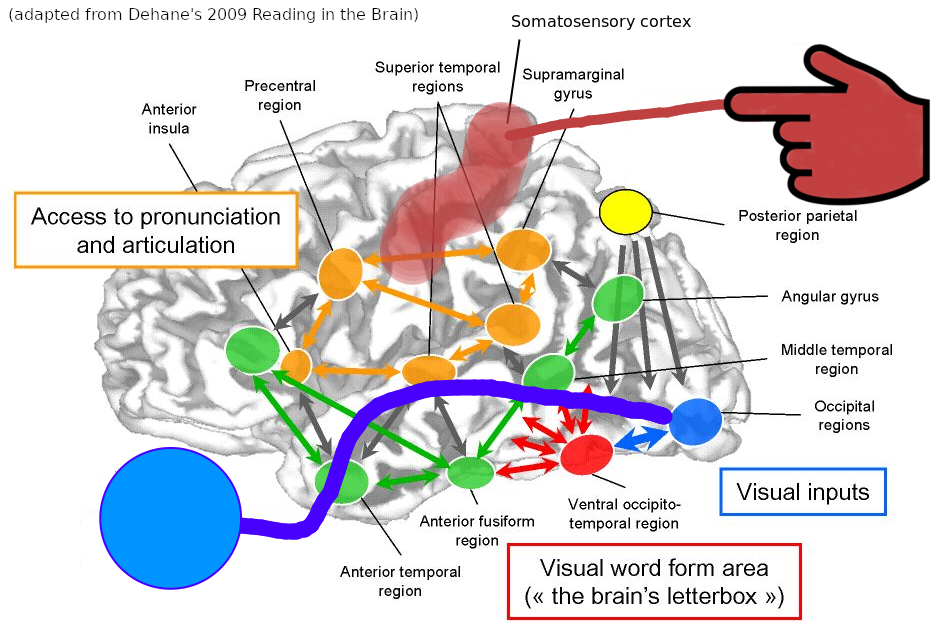
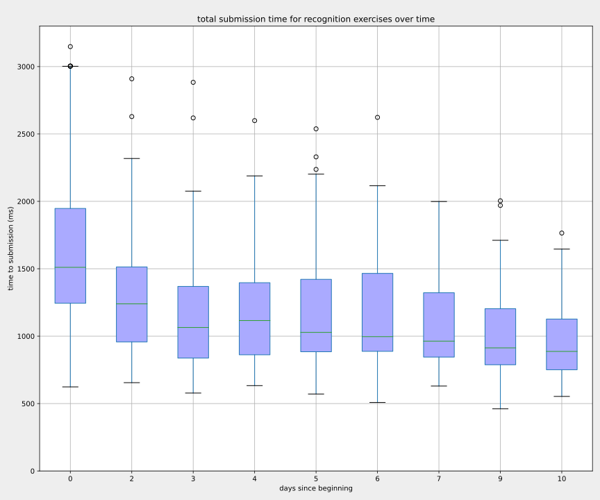
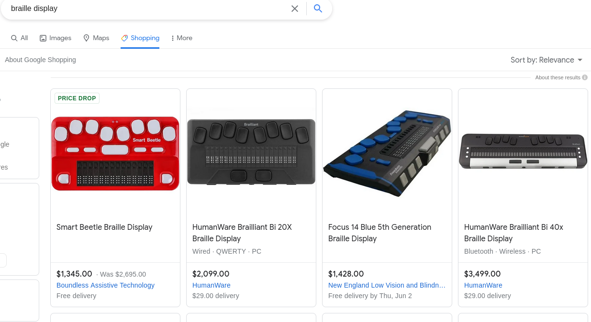
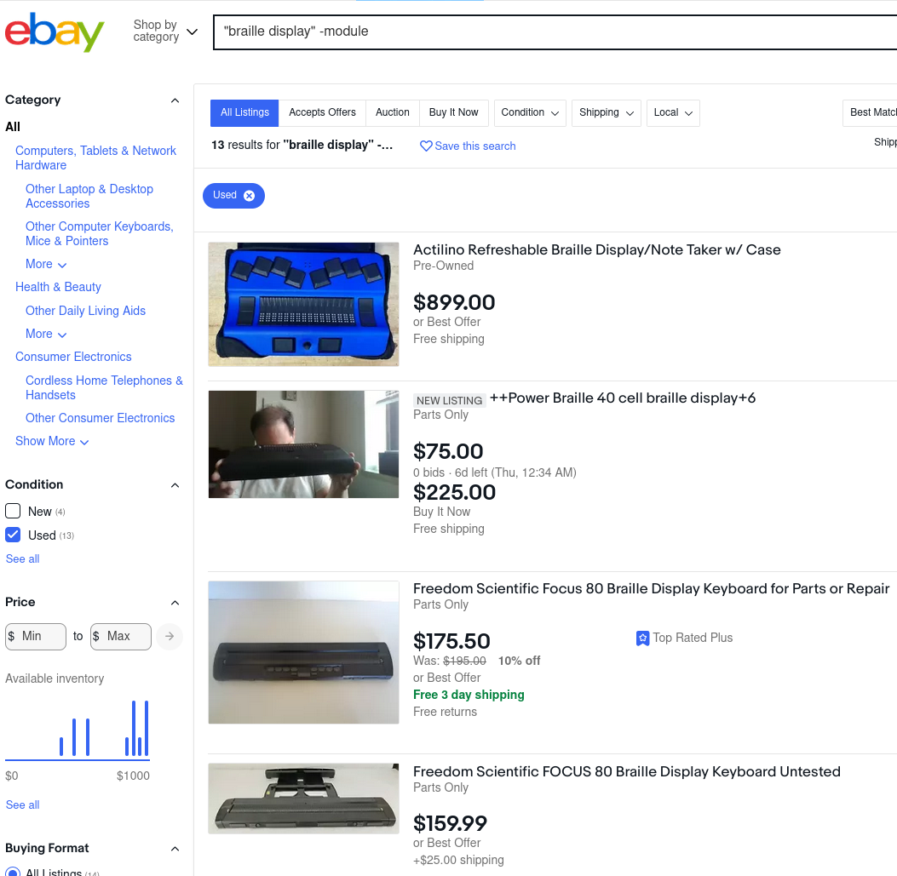
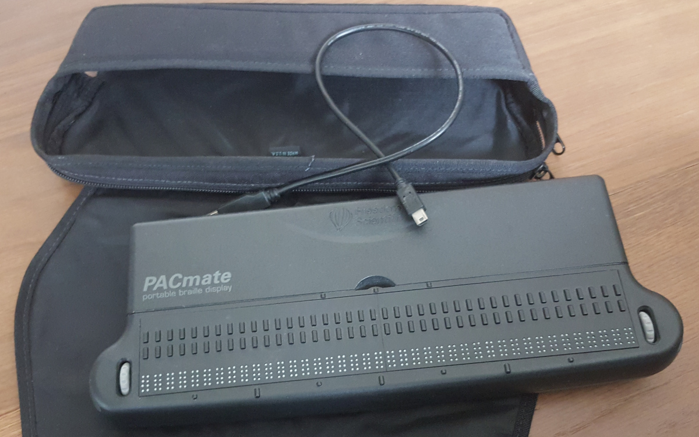
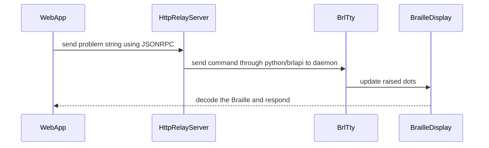
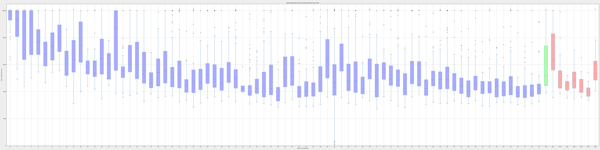
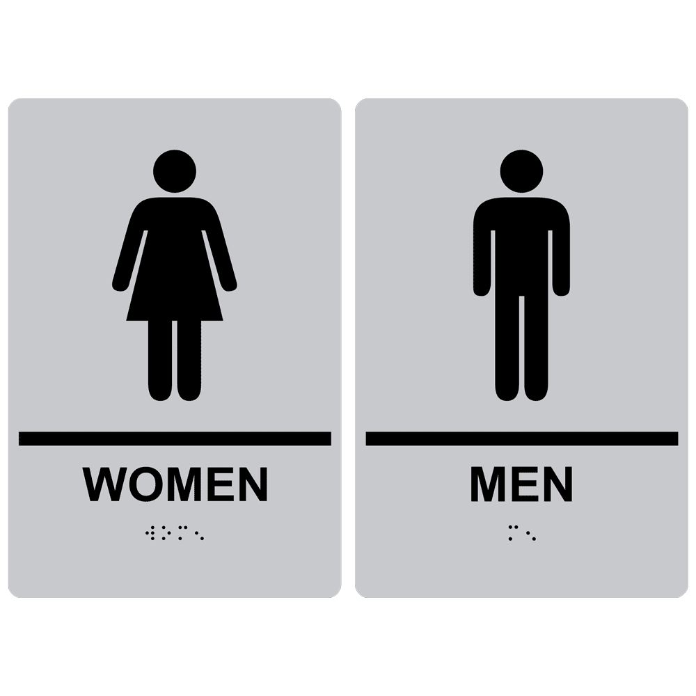
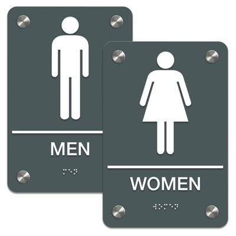
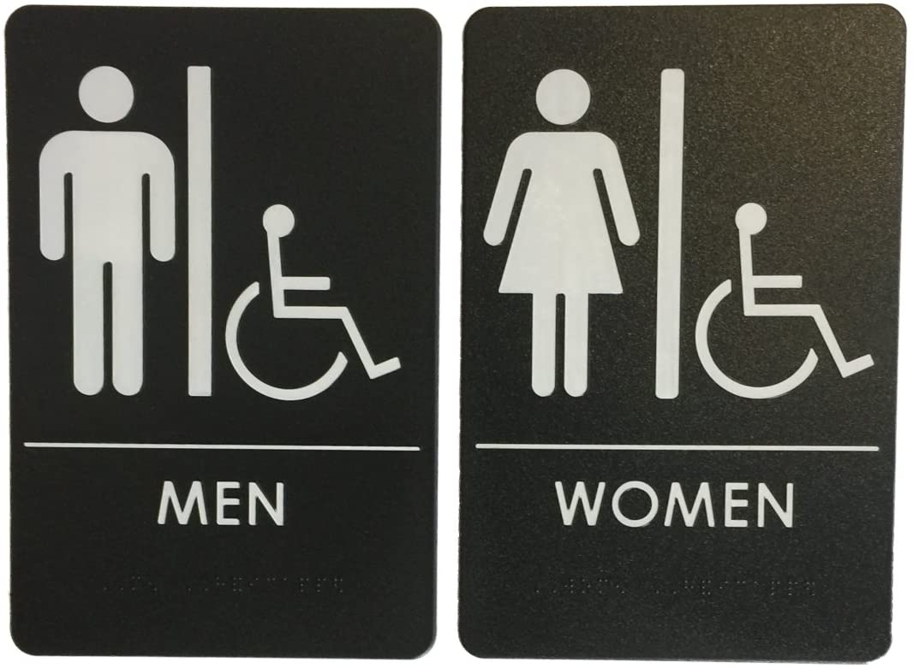

#blog


# what's written on matzos?

Many years ago, I shared office space with a fascinating man named Mike. An elderly fellow with a long career in finance, every morning he would plop into his Aeron and spend the day making calls to his buddies, probably to arrange for them to give talks or join a new financial initiative. His hearing was poor, which was compensated by his booming voice. All the sound waves that missed his speakerphone simply spilled to the rest of the office. The students nearby got a kick from listening to him because of his no-shits-given attitude and dark humor. He would tell his friends: I have 3 children, each of them flawed in their own ways, but they have given me 6 grandchildren, each of them perfect -- grandchildren are God's way of telling you to not kill your children!

One day I overheard him telling a joke: at lunchtime during Passover, a Jewish man spots a blind Jewish man sitting at a park. Thinking that the Passover meal is better with company, he sits next to the blind fellow and offers a sheet of matzo. The blind man holds the matzo in silence for a moment, then exclaims, "who wrote this crap?"


source: https://en.wikipedia.org/wiki/Matzo#/media/File:Matzot_Ren%C3%A9_Neymann_Wasselonne_avril_2014.jpg

Maybe hearing Mike's joke planted the seeds, but in 2019, I decided to learn Braille. Some people asked if I'm losing my eyesight. My eyes aren't great, but they're still functional.

Of the five major sensory modalities, most people are familiar with auditory (spoken) and visual (printed) communication. Learning to read braille is one of the few methods of verbal communication readily learnable today, which immediately loads a new (tactile) sensory channel. A fascinating exercise of plasticity!

Yes, #DoItForThePlasticity [^learning-asl]

[learning-asl]: for a similar reason, a few friends and I signed up for an ASL class. The teacher was baffled that we wanted to learn it, _just to learn_. Do you need this for your job? No. Do you have deaf acquaintances? No. How did you decide to come here and learn ASL? Well, we just kind of woke up one day and googled "learn ASL" 🤯

# the approach

Since Braille is an alphabet, it involves a foundational skill of reading the individual characters, which then connects with a complex skill of perceiving words and sentences. In sighted reading, signals are transmitted through the optic nerve into the visual cortex, which then spreads into higher cortical areas for further processing, leading to comprehension. When reading in Braille, we are effectively swapping out the visual modality _input_ into the visual cortex, using the tactile modality input, into the motor cortex. Neuro-architecturally, it looks like this:


(crudely overlayed on figure from Dahaene 2009). See https://readinginthebrain.pagesperso-orange.fr/ for original figure and additional information on the visual pathway.

We are swapping out the blue inputs from the eye, with the reddish inputs from the finger.

[zotero:Brain activation related to the tactile perception of touching ridged texture using fingers](https://dx.doi.org/10.1111/srt.13122)

The full mechanism is far more complex because unlike physical systems, neural systems rarely work in isolation. But as an engineering problem, we're basically replacing the webcam for the keyboard.

# learning the alphabet

FIrst I need to remember all the Braille characters. This is a run-of-the-mill _paired associates_ memory task. I wrote a simple program that shows me the Braille character, prompting me to input the corresponding English alphabet.

![[../assets/braille-pa-screenshot.png]]
It's quite so fisticated and bluetiful, but I type `u` here because the answer is u.

The learning trajectory of paired associates over time:



It's interesting that a curve emerges very quickly from just a few minutes of daily practice. At the 10th day, I'm averaging less than 1 second from presentation to response. This is actually very unimpressive: casually measuring presentation-to-response for typing the Engilsh alphabet, I easily average under 500ms, or half the time. This is in some ways a gap between "fluency" and "native fluency".

If you want to check your own "native fluency" in the English alphabet, you can test yourself in this mini app:

<iframe
    src="https://simple-characters-rt.study.run"
    width=480
    height=480
    frameborder="no"
    scrolling="no"
    style="margin:0;padding:0;border:none;border-radius:0.5rem;overflow:hidden;"
></iframe>

Anyway, it doesn't take long to learn 26 alphabets. After a week, I mostly had no problems visually recognizing Braille alphabets by sight. At this point, I tried to read Braille when I came across it: on public signs, on elevators, it's _there_ when you look for it. But for the most part, it's usually just building floor numbers and simple words like "exit".

So it looks like I've gotten reasonaly stable response times on the Braille alphabet. But wait! Visual recognition... of a tactile alphabet? That's like describing Starry Night as "swirly yellow dots in blue sky". #ModalityMismatch

To really learn Braille, I must *touch* it.

# learning the feeling

I purchased a [Reizen RL-350 Braille Labeler](https://www.amazon.com/Reizen-RL-350-Braille-Labeler/dp/B00II08XH6), which is essentially a Dymo label maker, but for Braille.


I created different labels and stuck them on objects with the names on the labels, like "⠺⠁⠞⠑⠗⠀⠃⠕⠞⠞⠇⠑" (water bottle). I also stuck pangrams [^pangrams] on my desk, which I would use for unscheduled reviews of the alphabets. Finally, I covered the letters on my keyboard with Braille versions of the letters.

[^pangrams]: I used these 2:
    - ⠁⠀⠟⠥⠊⠉⠅⠀⠃⠗⠕⠺⠝⠀⠋⠕⠭⠀⠚⠥⠍⠏⠎⠀⠕⠧⠑⠗⠀⠞⠓⠑⠀⠇⠁⠵⠽⠀⠙⠕⠛ = `a quick brown fox jumps over the lazy dog`
    - ⠏⠁⠉⠅⠀⠍⠽⠀⠃⠕⠭⠀⠺⠊⠞⠓⠀⠋⠊⠧⠑⠀⠙⠕⠵⠑⠝⠀⠇⠊⠟⠥⠕⠗⠀⠚⠥⠛⠎ = `pack my box with five dozen liquor jugs`

For the most part, this was unhelpful for the following reasons:

### labels on objects
- for labels on objects, like "bottle", I almost never have the intention of reviewing Braille when I grab the bottle. And when I do, I'm simply confirming -- not reviewing -- that what I'm feeling says "bottle".

The best use the labels is probably for differentiation; for sighted people, this use case is so infrequent that this really isn't an ideal tool for learning.

### labels on the keyboard
- labels on the keys are very hard to feel just by resting the fingers on the keys.
- the labels are naturally convex, opposite of the concave keys, making adhesion weak.
- the labels easily move on the keys. A slight rotation makes a different letter!

### other problems with Braille labels

The "readability" of the raised dots depends on how well they are pressed from the labeler. Careless insertion of the label tape leads to poor spacing, or even incorrectly positioned, dots. The raised dots can also come out barely "legible". You might think that pushing harder would give clearer dots, but at least in my labeler, pressing extra hard engages the label cutter, so I need to press firm, but not too hard.

Finally, the stickiness of the label degrades over time. Since the labels come in rolls, they have a tendency to curl up. After a few weeks, as the stickiness wears off, the labels curl up, and fall out of sight, putting the information out of touch.

### stickers are simply not good for casual learning

If you already read Braille, these labels are good for _discriminating_ things, such as a salt vs pepper shaker, milk vs water. If you are _learning_ Braille, the predictability of the labels means you are not exercising much recognition memory because there is little opportunity to make classification errors.

Needing a better solution, I set out to find something that could output Braille on command. And sure enough, there is a fascinating market of [Braille displays](https://en.wikipedia.org/wiki/Refreshable_braille_display).

# Braille displays

It turns out Braille displays [are](https://store.freedomscientific.com/collections/braille-display-and-notetakers) [very](https://store.humanware.com/hus/braille-devices) [expensive](https://thelowvisionstore.com/collections/braille-displays-and-notetakers) (as of this writing, a new display from these links range from $1295 through $8815), probably because it's a niche market.



The resell value varies widely.



Since my goal is to find a device for braille-on-command, I searched for existing methods of programmatically controlling braille displays, and discovered the sages of [brltty](https://github.com/brltty/brltty).

I combed through listings on eBay for compatible used displays, and purchased a Freedom Scientific PAC Mate 40 for around $200. This is a 40 _cell_ display, meaning I have a line to display a string of 40 characters.



# the expanded learning system

## the program setup

The system now needs to communicate between the little web app, a central controller, and the PACmate 40; here's how the signal flows:



## HttpRelayServer

this is a dumb relay server that ferries signals between the webapp and the display, which can be found here: https://github.com/whacked/brltty-display-server

## WebApp (the interaction layer)

The interaction layer is a small ClojureScript web application [^thoughts-on-cljs]. For the tactile response mode, it simply contains an input field where I would type what I read from the Braille display.

[thoughts-on-cljs]: Initially, the ability to hot-reload UI elements and test effects from a browser-connected REPL from emacs was a truly empowering method of design. I came to regret this decision, because after leaving the code untouched since 2020, revisiting it a year later meant I had to battle with stealthy tool changes and ninja library teleportations. For a simple, prompt-and-input app, it was infuriating to have to examine JVM stacktraces, nREPL version compatibility warnings, and figwheel/shadow-cljs configuration conflicts. Clojure is great except when the _tooling_ breaks; then it's a wild ride before anything builds.

### learning tactile recognition, one hand at a time

In order to minimize the time between tactile recogntion and response, I split the left and right hands into separate roles: read with the left hand, type with the right hand, and vice versa. This has the drawback of artificially restricting the possible characters for each training session to a smaller pool, making the results looking better than actual. For example, "Z" (`⠵`) / "N" (`⠝`) and "R" (`⠗`) / "O" (`⠕`) are similar in structure, but splitting them into separate input tasks removes the possibility of encountering them in the same session.

### both-handed reading

After revisiting the tactile task in 2021, 2 years since I started and a full year after no practice at all, I noticed that recognition remained surprisingly stable. This suggests that my fluency with one-hand-at-a-time Braille reading is pretty solid (or pessimistically: completely plateaued), so I added a both-handed reading task, where I would read a line of Braille and type it in the keyboard. The format of each line is as follows:

```
# C: a random character, a through z, sampled with replacement
# some-word: a valid word from a dictionary
# #: the pound-sign (⠼) that signifies numbers
# N: a random number, 0 through 9, sampled with replacement

CCC some-word #NN
```

Using valid words means letters like "X", "Q", and "Z" show up less, and allows the brain to "cheat" by trying to complete the word before the fingers finish reading the full word. So we add 3 random characters to the beginning (3 is short enough to keep in memory). Finally, we add 2 random numbers so we also practice those.

This is my final practice setup, and I stopped spending time on visual recognition and one-handed reading.

# results

## tactile recognition speed, skill decay, and skill refreshment

After practicing Braille reading for 90 days in 2019 (shown in blue below), I took a break, but not before reaching a clear plateau. I promptly forgot about the task for a full year.



Green shows my revisit after 1 year, and red shows me revisiting the task over another year after that. I clearly slow down, but more interestingly, it picks up rapidly in successive sessions, near previous levels. All these sessions are short: a few minutes per day.

So uh, remember how teachers tell students to not procrastinate? This is the effect of not procrastinating.

On the other hand, it is unclear how far I can really push my fluency. I suspect when learning skills of fluency without pressure, the plateau is biologically determined: by _your make and your age_. As such, once the plateau is reached, one needs to make a few considerations:

- how much marginal benefit is there in continuing practice
- what is the actual cost of maintenance of my current level

There might be some kind of interpretation of "deliberate practice"  where lack of improvement suggests some sort of lack of "deliberation". Considering that the goal of motor skill mastery is automatization, and I have reached some level of automatization, the bottleneck of processing is no longer centralized in sensorimotor processing.

[zotero:Accelerated relearning after retrieval-induced forgetting: The benefit of being forgotten](https://dx.doi.org/10.1037/0278-7393.34.1.230)

[zotero:On the durability of retrieval-induced forgetting](https://dx.doi/org/10.1080/20445911.2012.674030)


# interesting episodes

It turns out the strategy of learning A through Z in Braille and thinking I'd be able to read sentences was too naive. Printing Braille labels was one thing, but reading Braille in real life signs is another. What I learned was "Grade 1" Braille, while "Grade 2" Braille is everywhere once you start reading around.

## the bathroom

The first time I noticed this was on the signs for the bathrooms, when I realized that the sign for the women's bathroom was spelled "womn". I found my way correctly to the mn bathroom, but only later learned that "en" has a shorthand in Grade 2 Braille (`⠢`) which _looks like_ the character for "e" (`⠑`) but "shifted down" one row of dots. For the unfamiliar, sighted reader, it's easy to miss!

| ascii | Grade 1 | Grade 2 shorthand |
| ----- | ------- | ----------------- |
| women | ⠺⠕⠍⠑⠝   | ⠺⠕⠍⠢              |

[these](https://signcollection.com/blog/cat/ADA/post/Braille-Signage-The-Basics-of-Grade-2-Braille/) [pages](https://signcollection.com/blog/cat/ADA/post/Why-Braille-Signs-Use-Grade-2-Braille-and-Not-Other-Grades/) explain that Grade 2 allows shorter phrases in the same space, which allows for more efficient sign reading. Intuitively, the simpler character set has greater reach (and accessibility), but perhaps with concerns for safety ("exit", "fire alarm"), a mandate for speed is justified. In any case, I assume that readers must be proficient in at least Grade 2 to understand Braille patterns for daily necessities.

[this page from compliancesigns](https://www.compliancesigns.com/pd/silver-ada-braille-women-men-restroom-sign-set-rre-125-145pairedset-black-on-silver) shows a Grade 2 spelling sign pair


this pair from [seton](https://www.seton.com/man-woman-premium-ada-braille-restroom-sign-sets-l10282.html) for example, uses Grade 1 spelling


Interestingly, since the dots do not need to be visible _in light_, you can find many signs such as [this one on Amazon](https://www.amazon.com/Rock-Ridge-Unisex-Restroom-Black/dp/B0195V156M/ref=psdc_2896433011_t2_B07CZN87V7) where the dots are very difficult to discern by _sight_.



Here, the women's sign says "women" (wom-en) then "handicapped" (h-and-i-c-a-p-p-ed) in **Grade 2**. If a sighted, non-Braille reader was making a purchase decision for this sign, they will have a lot of trouble checking if the sign used Grade 1 or Grade 2. Well... they probably don't check anyway.

# So... what's written on matzos?

Now I can understand what the blind man read on his maztos: it's utter "crap". Well, let me explain.

Just like with reading words, in order to read Braille, the brain needs to be in a "reading mode". If I place my finger onto a surface of raised dots, my brain _will_ be placed into a "reading Braille" mindset, just as your (sighted) brain is placed into a "reading text" mindset right now. So when you read the text below:


you don't make sense of the text [^matrix] because there is no text -- only text-like visuals generated by deceptively familiar _visual primitives_. The protrusions on matzo sheets resemble _tactile primitives_ as raised dots; if you forced your brain to decode the protrusions, it will decode the primitives. But put together, the primitives don't construct any comprehensible, larger patterns. [^simulating-aphasia] In plain English: crap.

[matrix]: but if you watch a lot of movies, maybe you'll see a womn
[simulating-aphasia]: for the same reason, this is one way to simulate the feeling of aphasia in reading

Actually, I cannot speak for the the blind Jewish fellow. Maybe he did actually read the matzo, and it was as bad as this joke.

# did I gain any other interesting abilities?

Doubtful, although I very likely expanded some tactile processing areas in my brain (not in my fingers: tactile sensitivity of the fingers is limited by your _finger size_! [^finger-sensitivity]).

Does it make a difference? Probably not. But alas, #DoItForThePlasticity

[finger-sensitivity]: [zotero:A Physical Constraint on Perceptual Learning: Tactile Spatial Acuity Improves with Training to a Limit Set by Finger Size](https://dx.doi.org/10.1523/JNEUROSCI.0514-13.2013)

# other related topics of interest

## possibly interesting examples of specialized skills relying on highly-tuned tactile perception

- sushi chefs, chefs
- piano tuners
- daiku
- palm reading
- tailors
- mahjong https://riichi.wiki/Moupai
- surgeons
- magicians, see this [fascinating comment by a coin magician](https://news.ycombinator.com/item?id=31609796)

## cool people who use Braille

- Anthony S. Ferraro @asfvision https://www.youtube.com/watch?v=f9wodMpmseM

## overlearning

- what counts as overlearning?
- what counts as automatized?
- what counts as chunked?
