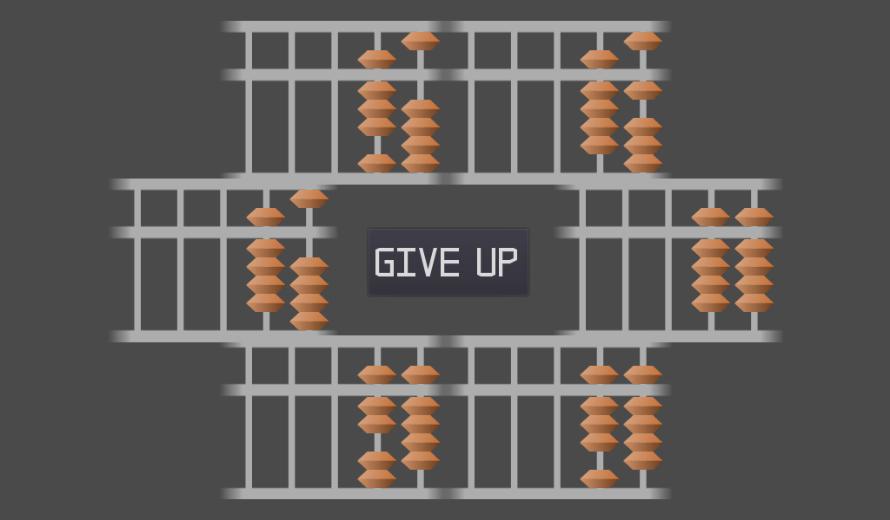
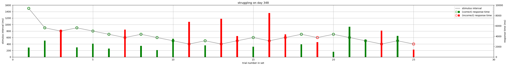

# learning mental calculations (anzan) as an adult

This is a follow up to my journey of [learning how to calculate using a soroban](learning%20the%20soroban%20as%20an%20adult.md). Last year, after I got fluent with the basic operations of the soroban, I started specifically practicing visual operation of the soroban. Meanwhile, from tracking my progress from daily practice, I found my performance reached a ceiling in mechanical calculation, so I decided later in the year to stop practicing mechanical operation, while continuing practice of mental calculation using the abacus, also known as "anzan" (暗算).

It's been a bit over a year since I started practicing anzan on a near-daily basis.

# my practice setup

I wrote a small application that flashes numbers to add/subtract, then displays 6 different choices of the final arrangement of the soroban, out of which I click the correct one.

For the sake of measurability, at the beginning I kept the design parameters constant (the `stimulus interval` or the duration of flash, the `interstimulus interval` or the time between each flash, the `distractors` or number of incorrect alternatives to choose from), using `response time` as the main variable of interest. This is the same variable I tracked in the earlier investigation, where acquisition of soroban operations was the main goal. As we will soon see, this metric is not the most suitable for anzan.

Almost every day, I practiced this 2-digit anzan exercise.

Every round of the exercise flashes 6 2-digit numbers with 0.5 seconds of spacing (a blank screen) in between. On the first day, the 2-digit numbers were displayed for 5 seconds before the spacing, then flashing the next. This was easy, so I lowered the flash duration to 4 seconds, then 3 seconds a few days, then 2 seconds. I continued the 2-second regimen for nearly 4 months:

It's hard to see concrete improvements from the plot, although towards the end, the task is noticeably easier: the ratio of correct responses (red dots) are generally pretty high (though not perfect). One problem with the task becoming easy is that the mind starts to drift, increasing the error rate. As a result, I wasn't consistently improving my response time over time, even though the task _was_ getting easier. I was simply paying less attention to my performance.

For these anzan calculations, I use my fingers to operate a "virtual" soroban on the table, so I'm actually physically moving my fingers, and imagining myself moving the soroban beads as the numbers are shown on screen, sort of like method (1) in this video:

https://youtu.be/ajZK8I3cWCw?t=3

During these sessions, I always felt that using my fingers was very helpful for recalling the soroban state, because I had both the mental imagery of the soroban, plus the kinesthetic memory of performing sequential motions, acting as a double-checking source of information. For example, sometimes I would lose track of the position of 5-keta bead, but recover it from recalling that I just moved my finger there earlier.

The near-daily practice regimen is pretty short: usually 10 trials, taking around 3 minutes per day.

My program was very sloppy, so I had to update the code everytime I changed the flash interval. After about 2 weeks of practicing with a 1500ms flash duration, I switched to a dynamically updating variation, where the flash time would speed up by 100ms after a correct response is made, or slow down by 100ms after an error. At this point, the goal is to see how fast I can go.

It's not straightforward to get trend information from this plot; it tries to show for each day I practiced, the number of times I stayed on a flash duration level. The wider the bar, the more times I visited that level. A perfect run, where every trial is responded correctly, will have a thin line.

Every day I start at 1500ms per flash, and try to get to 500ms: the minimum limit when I started dynamic trials. The day I started (day 140), I only made it to 1000ms. As time went on, I would more easily and stably reach the fastest setting of 500ms.

Focusing on only the 500ms flash trials across the days, it's clear that after 300 days of practice, I'm _usually_ getting them right:

Though again, at this point, my mind wanders even at this speed, which adds variation to response time and correctness results.

Around month 9 (day 270~) I began to deliberately focus more on visualization, and move my fingers less. Initially I would keep my fingers still, but still imagine actually moving them: I would apply a tiny amount of force to my fingers so that my brain is still executing the mechanical instructions. Then about a month after this, I stopped moving my fingers altogether, and focused entirely on visualization.

Around month 11 (day 327), I adjusted the minimum flash duration down to 200ms. Due to a bug in my code, the task still starts at 1500ms, but jumps to 900ms after the first correct response. Afterwards, it continues to move up or down dynamically. I always _try_ to reach 200ms before stopping. 16 months in, I am able to reach 200ms on most days, but it takes effortful concentration.

# the nature of anzan

I now have a clear understanding of being able to visualize a soroban in the mind, although it's only 2 digits wide. When I perform operations, I faithfully apply the soroban operations to the beads and the columns, and at the end of all operations, I read the result out of the soroban in my mind. During calculation, the operations are entirely visual: beads are moving up and down, carries moving left and right. There is no notion of numerical "addition" and "subtraction" as we usually think. In fact, the less numerical awareness there is, the quicker and more accurate I can calculate. Numerical awareness actually becomes a hindrance, becuase the crucial steps are to first convert numbers into their soroban representations, then operate entirely in "soroban space".

Possibly due to my late age of acquisition, it's extremely hard to shut off numerical awareness. But sometimes when I see an operation like `-96` when I have `100` on the board, I will first attempt to think of the "correct" operation order (down 1 on the 100s column, up 1 on the 10s column, down 1 on the 10s column, up 4 on the 1s column) but instead recall the result is `4`, abandon the operations, and move on. This is cheating because it bypasses the soroban circuit, but when the next number appears on the screen, I'm still often not fast enough to execute the full carry-down operations.

That said, 500ms is quite easy now. I can have music or speech playing in the background. But below 400ms or so, distractions become highly disruptive. Firstly I must keep a visualization of the soroban at all times. A brief lapse in attention can corrupt the visualization of the soroban arrangement, or delay perception of the number on screen or its conversion into the soroban. And once I miss one flash, it's very hard to recover.

# the nature of mental readiness and warming up

One question I had early on during these practice sessions was: if my goal is to optimize my rate of improvement, how much warm up is sufficient? I didn't answer this question directly, but noticed something interesting about the "peak performance trials", which currently for me is the 200ms flash trials.

Firstly, there are days when I'm totally wired and focused. I'd handily get most trials correct, run all the way down to 200ms, and stop.

Plotting the reducing stimulus intervals across successive correct trials and their response times gives this example of a perfect run:

Then there are days when my brain is simply unable to reach that level, like when I am sleep deprived or mentally drained. No matter how hard I try to focus, my attention lapses so frequently that I cannot register all flashes or complete all operations. Or my mental imagery is so weak that the soroban is too diffuse to hold a shape. When this happens, I push to the point where I hit a barrier and stop. Here are some example runs where I gave up:

Finally, there are days when my brain needs time to switch gears and complete the faster trials. Before that, I would be inattentive, obviously producing poor results. In the data, this results in a "meandering" response pattern, where I repeatedly move up and down the difficulties, and at some point, when my brain is more tuned in, I manage to reach 200ms.

Since the hardest trials invariably require a high level of concentration, in these "meandering" cases, it's possible that at the end of the runs, the brain's state is more aligned to the task. In other words, it's possible that at the end of the 2 meandering runs above (day 346 and day 392), the brain is in a similar "warmed up" state as the brain was at the end of the perfect run on day 372. Needless to say, a brain ready to make a perfect run is not in the same state as a brain that requires extensive warming up, but I suspect if we were to measure e.g. blood flow or cortical coherence before and after warming up, and compare them to the states against the perfect run state, the warmed up brain would move closer to the perfect run brain.

This is an interesting thought, and the soroban task provides a reasonably clean setup to actually test this hypothesis, since it consistently demands a high focus, loads a simple working memory structure and the visual scratchpad, while being highly repetitive, simple, and automatized. The problem is that it takes a _long_ time to become a useful measurement.

Another follow on question is whether the brain is in the best learning state after warming up, i.e. closer to the perfect run state. I suspect the best learning state is close to the flow state: warmed up, not overloaded, but moderately stressed. If this is true, then I am _never_ practicing optimally: I am stopping at the very moment I should practice harder. But honestly, I'm not _that serious_ about getting better.

# 2-digit anzan to 3-digit anzan

After reaching 200ms flashes on a regular basis for 2-digit anzan, 3-digits would be the next obvious step. Since it would be harder, I figured I'd just do it slower. So I started a 3-digit anzan task at 5 seconds per flash. This was a total failure. I couldn't even finish the first trial. Expanding the visual soroban from 2 to 3 digits is a completely different level of visualization. It's _extremely_ easy to lose track of the columns and especially the 5-bead positions while operating on another column. The mental image just evaporates into the void.

But recalling that when I first started adaptive flash times in 2 digits, it took me 5 days to reach 500ms flash times. So I'm not deterred; I'll simply grind every day and expect my brain to rewire itself eventually.

For 3-digit anzan training, I'm using a drastically simplified design: 3 flashes at the same stimulus interval. Currently I have standardized at 2500ms regardless of correctness.

About 3 months in, my results are still all over the place. I believe I'm improving, but it's probably going to take several more months of practice.

# final thoughts

One day I saw a video on reddit of a boy doing mental calculations

https://old.reddit.com/r/toptalent/comments/rxhl29/mental_math/

and I realized that for the 2-digit addition/subtraction questions, I have been practicing at about the same speed as the child! That said, I wouldn't qualify for top talent. For starters, there's performance under pressure and noisy environments. And to qualify as "competitive", here's an example of how fast anzan contestants go:

https://youtu.be/7ktpme4xcoQ?t=3

I'm pretty sure that's out of my reach. Regardless, I have practiced this skill regularly for over 2 years now. I have been very _disciplined_ about practice but have not been very _intense_ about it: less than 5 minutes a day! Summing up all the minutes puts my _lifetime practice_ at just slightly over 30 hours.

When I begun learning the soroban, I had no intuition of how the "abacus in my head" would manifest, much less that I would also be able to see flashes of numbers, and by moving beads on a virtual soroban in my mind, be able to calculate 2-digit sums in sub-second speed. It used to be a foreign concept to me, but like riding a bike, I'm now on the other side: I have forgotten what it feels like to not know.

Given my casual approach at this, what would I say to other adults interested in learning the soroban? First, it's not practically useful. It's _interesting_ to learn a new trick, but it's even more interesting to cultivate a new ability and cross the chasm of mystery. If the neural circuitry is old, it takes more time. But when I first started 2-digit anzan, I thought 500ms was fast! And now, I think it's slow. The gains may happen _very_ slowly, but even so, if you _just want to get to the other side and see for yourself what it's like_, a few minutes day may be all you need.

# learning journal

### 2022-09-02 00:55:02+08:00

need to figure out whether feedback can help.
it's very easy to feel that you've made an off-by-one error and are not able to recover.
maybe there's a better way to specifically practice off-by-one errors.

also there are times I'm completely wrong, and the answer is not in the choices.
one possibility is to show choices where no result is correct?

### 2022-09-03 02:01:51+08:00

when performed correctly, the brain is generally not thinking about numbers during calculation.

sometimes when I'm calculating a new sum, since the operations go left to right,
before I reach the rightmost column, I don't actually "perceive" the sum.
I'm in an intermediate, non-numeric state.
then after the final operation, I read the sum from the board.

### 2022-10-15 01:23:07+08:00

exercises felt easier today, i think due to an interesting change.
previously I allowed myself to use my middle finger to operate the mental soroban,
so when both 1 dama and 5 dama up, I would use the index finger and middle finger at the same time.
i noticed this causes confusion as to which 5 dama got moved in the next operation, because when i try to recall the position, the middle finger is long enough to reach to the next column.
today i decided to disallow myself from using my middle finger, by balling up my middle, ring, and pinky fingers.
this forced me to only use my thumb and index finger.
i realized my movements are not "standard", possibly due to my training setup.
but when i mostly try to stick to "standard" motions, recalling the board position seems much less ambiguous

### 2023-02-24 00:37:20+08:00

my performance seems to be tied to how little numerical awareness I have. In other words, the more purely mechanical I am processing the information, the better I do.
currently, around the 600ms mark, is where I really feel that the shutting off of numerical awareness makes a large difference in performance.
so I wonder how much of the improvement is driven by ability to downregulate the awareness, or to upregulate mechanical fluency

### 2023-06-05 23:30:34+08:00

started to focus on calculating without using fingers. so i place my fingers on the table but do not move them.
it seems like at faster speeds, I still gain from using fingers, probably because it adds an additional "backup" modality to keep track of the soroban state.
otherwise, I am trying to focus only on the visual soroban, which in lower speeds, is entirely sufficient

### 2023-07-20 00:46:34+08:00

recently have fully adapted to fingerless calculation, full visualization + motions only

### 2023-08-08 00:16:41+08:00

handled a problem that i was too slow to calculate by recalling the operands and then applying the mental operations on the soroban from visual memory.
this is obviously made possible by the soroban's scratch pad

### 2023-12-09 01:39:18+08:00

anzan is very sensitive to interference.
after getting fluent i often listen to music or speech while doing anzan, and it's generally detrimental.
today's submission, i hit 200ms then kept erroring back to 600ms, then turned off the music, then went back to 200ms
