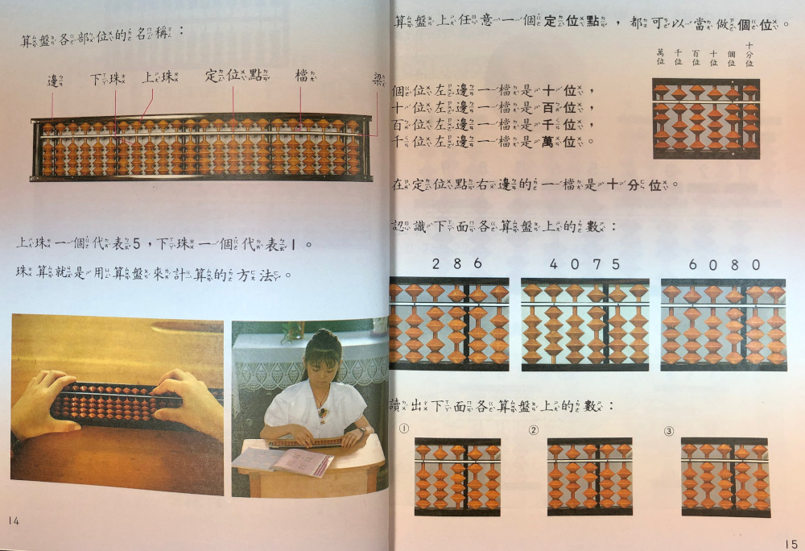
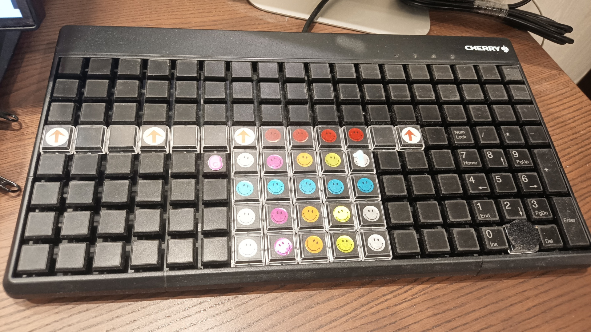
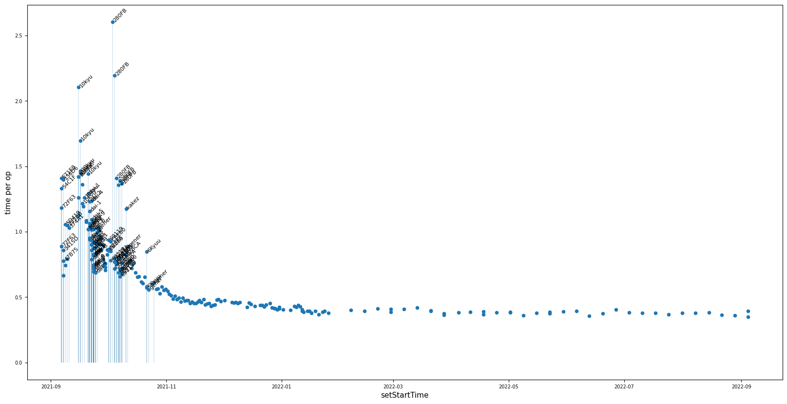

# So-rob-an abacus

During the 90s, the Ministry of Education in Taiwan thought it would be useful to teach students how to use the [abacus](https://en.wikipedia.org/wiki/Soroban) [^chen-2008], so it was included as part of the standard mathematics curriculum [^abacus-in-textbook] [^abacus-influence].

To most children, it was just another lesson among many others, like the lessons on breeding silkworms, growing mung beans, and how Chiang Kai Shek was inspired to work hard after observing fish swimming upstream [^fish-story] (basically a Kuomintang version of _George Washington and the Cherry Tree_).

[^chen-2008]: 陳秉筠 2008. _The history of Taiwan Mathematics Curriculum Standards: Case of Number and Calculation Standards_

[^abacus-in-textbook]: another page from elementary school textbook 

[^abacus-influence]: Incidentally, the "Windows Calculator" app bundled with the Windows operating system is called [小算盤](https://zh.wikipedia.org/zh-tw/小算盤) ("little abacus") in the [zh-tw](https://github.com/microsoft/calculator/blob/master/src/Calculator/Resources/zh-TW/Resources.resw#L121) locale, but is called "计算器" (calculating device) in the [zh-cn](https://github.com/microsoft/calculator/blob/master/src/Calculator/Resources/zh-CN/Resources.resw#L121) locale.
[^fish-story]: look at all the brave fish that inspired Chiang Kai Shek 

At any rate, as one of those students, I also bought an abacus and spent a few classes pushing beads up and down. Just as the silkworms turned into moths and died, and the mung beans sprouted and withered, the abacus found its resting place in some drawer, never to be seen again. Yet, as I grew up, it still carried a mysterious, powerful veneer: every once in a while, an abacus master would appear in the media, performing incredible feats of calculation.

Now, while we can agree that math education is important, _calculation_ is just one kind of brick in a castle: foundational, but vanishes in the grand structure. To me, superhuman calculation ability never looked that useful beyond the spectacle. But the mystery remains, in the same way the "runner's high" is a mystery to me: I can only rely on translations by people who claim to experience it.

# The soroban (Japanese abacus) in the 21st century

Years ago, a popular Japanese comedy host featured a group of absurdly talented students from Tokyo University, known to be Japan's premier university [^sanma-no-show]. One student, Kasai Yumi, being able to solve 38 out of 40 problems like the ones below within 3 minutes, received a _10-dan_ (the highest) mental arithmetic rating when she was in 4th grade:

[^sanma-no-show]: さんまの東大方程式 第２弾 2018年9月17日 [here is a yet-viewable clip](https://youtu.be/VBapHsqtwJg?t=1207)

She explains, by moving her hands, she can calculate the problems. "There's an abacus in my head," she says.

Incidentally, while this show is mostly comedy, Kasai is listed as a 2-time gold medalist at the China Girls Math Olympiad [^kasai-yumi] so her mathematical prowess goes beyond fast calculation.

[^kasai-yumi]: https://www.imojp.org/archive/laureler/cgmo/record_cgmo.html and https://baike.baidu.hk/item/%E4%B8%AD%E5%9C%8B%E5%A5%B3%E5%AD%90%E6%95%B8%E5%AD%B8%E5%A5%A7%E6%9E%97%E5%8C%B9%E5%85%8B/1580877

# Tools vs talent

There are plenty of known cases of people who attained exceptional calculation ability without special training, including Srinivasa Ramanujan, John von Neumann, Richard Feynman, among others.

## Rüdiger Gamm

One of the more recent and publicly recorded instances was that of [Rüdiger Gamm](https://en.wikipedia.org/wiki/R%C3%BCdiger_Gamm), who competed on television against Hiroaki Tsuchiya, a meijin [^tsuchiya-hiroaki] soroban expert. [Rudiger Gamm vs. Hiroaki Tsuchiya](https://youtu.be/68yGYvMxQKI?t=73)

[^tsuchiya-hiroaki]: 土屋宏明 https://www.shuzan.jp/kyougikai/kekka/meijin15/
[^meijin-competition]: https://ja.wikipedia.org/wiki/%E7%8F%A0%E7%AE%97%E5%90%8D%E4%BA%BA%E4%BD%8D%E6%B1%BA%E5%AE%9A%E6%88%A6 example: https://www.youtube.com/watch?v=EztExEiphFo around 59s, this video also demonstrates one of the competition items, "伝票算", which translates to "voucher calculation". Since it involves actually flipping through sheets of vouchers, there is an additional component of physical dexterity, which has nothing to do with numbers. Nevertheless, the overall speed of calculation is still astoundingly fast for humans.

Gamm's calculation prowess has been investigated at the cortical level in academic literature:
- [zotero:Mental calculation in a prodigy is sustained by right prefrontal and medial temporal areas](https://dx.doi.org/10.1038/82831)
- [zotero:What makes a prodigy](https://dx.doi.org/10.1038/82841)

Assuming that Gamm's brain was specially pre-optimized for mental arithmetic, it's amazing that someone else who is probably _not_ pre-wired is able to reach comparable levels through the use of technique.

How does that work? At a high level, given that the brain size is fixed, the use of technique effectively teaches the brain recruit _other_ pathways that support managing and transforming the information through an encoding/decoding process (something Gamm's brain is doing automatically). In the case of the abacus, the numeric values and transformations get spread to brain regions not typically used for processing numbers, such as the motor cortex (which processes the finger movements), among others [^among-other-regions]. But in order to send and store numeric information in the form of motor signals, we need to teach the brain a conversion process.

[^among-other-regions]: this is a simplification; the whole story is probably still unclear

# Connecting abacus expertise and mental calculation

Based on information from The League of Japan Abacus Associations, there are 2 main types of exams of certification of abacus skill: `shuzan` (珠算, or _bead calculation_, where you operate an actual abacus) and `anzan` (暗算, or _invisible calculation_, where you operate a _mental abacus_). Based on the example problems listed from the [league's page](http://www.shuzan.jp/kentei/mihon/), at the 1-kyuu level,

- shuzan requires summations of 10 10-digit numbers
- anzan requires summation of 10 3-digit numbers

so in effect, the physical abacus provides a ~3x expansion of task-specific working memory during calculation.

Another type of anzan exam is `flash anzan`, which involves mental calculation done with quick flashes of numbers.

## abacus calculation at the expert level

- #Shuzan 10-dan abacus exercises using both hands: https://youtu.be/0_11-FZpc1c?t=49
- #Anzan a 10-dan mental calculation example. The student doesn't move his fingers: https://www.youtube.com/watch?v=SB3Ik-MlGXY
- #FlashAnzan a 5-year old practicing at the 3-dan level; you can see her fingers operating a mental abacus https://www.youtube.com/watch?v=9PQmu_flZdc
- #FlashAnzan demonstration of 20 levels, easiest to hardest: https://www.youtube.com/watch?v=6QQHQpUBvxg
- #FlashAnzan a flash anzan competition: https://www.youtube.com/watch?v=gtHS9Yovy5A showing 3-digit numbers presented at a rate of 5 numbers per second.

Exceptionally good practitioners are able to compete for a "Meijin" title [^meijin-competition], which is something like a Grandmaster.

# Learning the soroban's language

One of the components of mental calculation by abacus is developing the ability to visualize an abacus in the mind's eye, or as Kasai explained, an "abacus in your head". But what does that mean exactly? Many people have trouble remembering the direction of Twitter's bird; how about 50 bean positions on the abacus? I assume it will be something like blindfold chess, but instead of picturing a chess board, you picture an abacus.

## how can people remember so many positions?

The mechanism behind blindfold chess is actually extensively studied. It relies on [chunking](https://en.wikipedia.org/wiki/Chunking_(psychology)) [^chunking]. But intuitively, chess loads much more heavily on long-term memory than the abacus, simply because there are more possible positions ([over 10^100](https://en.wikipedia.org/wiki/Shannon_number)) than the abacus (n^10, where n is the number of columns on the abacus). If a human stores every single configuration _and_ every single operation on a 2-digit abacus into long term memory, it would "only" be 100 x 100 = 10^4 facts. Compared to chess, the soroban's complexity is child's play, so we have a good chance to witness some long term memory consolidation and chunking in action.

[^chunking]: incidentally, some of the most influential work on chunking came out of studying Chess expertise, c.f. [zotero:Perception in chess]([https://doi.org/10.1016/0010-0285(73)90004-2](https://dx.doi.org/10.1016/0010-0285(73)90004-2))

## "chunking" sounds discrete, but is actually a continuous, gradual process.

It is easy to think about mental processes becoming more efficient from chunking by thinking that separate, smaller pieces of information get "chunked" into one unit of retrieval. This is a reasonable interpretation of the process, but let's add two clarifications:

1. chunking might seem discrete because the outputs are discrete (soroban operations, chess boards, sentences). This produces an imagery of information being "chunked" or "not yet chunked". But think about the soroban: chunking together all the carry-up (_kuriagari_ 繰り上がり) and carry-down (_kurisagari_ 繰り下がり) operations is a gradual process of fluency, where the mental burden of the motion sequence decreases over time, to the point where seeing the soroban configuration is enough to _automatically_ remember and execute the operations. The mind is then freed to think of other things -- ideally, the next few operations. In other words, calling it "chunking" is a concretized, but simplified, interpretation of the phenomenon of neuroplastic auto-optimization: it's axons all the way down, and you are _always_ forming "chunks".
2. the speed of "chunk formation" is the _speed of neuroplastic auto-optimization_, which is a highly biologically mediated process. Soroban skill is based on automatic, fine motor control, so it's no surprise that soroban schools are focused on children. They teach a foundational skill, where raw speed undergirds nearly all the value. It doesn't take any serious analysis of my own data to know that young children will learn faster and progress further than me.

## late language learning

For the record, I was 37 years old when I started this investigation. Without a doubt, I would learn the language better if I were younger. But just as not every chess player reaches grandmaster level, it's unlikely that every child can reach 10-dan by sheer practice alone (the ones who do, show up in the news -- so it must be pretty hard!). Everyone has a different learning curve, but the _one_ thing they have in common is that after peak neurogenesis, the curves trend down. You are _always_ racing with time. So the crucial question is: how hard do you want to push yourself?

There's going to be "hard for Grandmaster Carlsen right now", which is too hard for most people alive (but afternoon snack for Stockfish). There's also "hard for Magnus Carlsen when he was 7", which might be just as hard for you at age 28. Your curves may cross at some point, but what matters most is if you were able to bring yourself to your biological boundary, because at the frontier of homo ~~sapiens~~ techno [^homo-techno], that's what we're gonna do. We take our pithy wetware, and wring it.

[^homo-techno]: credit to this interview https://youtu.be/KOwm7GUjcg8?t=5

# Abacus as a tool for research of learning

In contrast to many other skill-heavy, practice-driven tasks, the soroban has several desirable traits as a tool for researching learning.

- very simple ruleset
- easily recordable responses
- narrow range of inputs and outputs: since operating the soroban produces a single result from calculation, the task is quite "clean". Skills like playing the flute have many more moving parts: auditory feedback, respiratory control, tactile feedback, sight reading, and probably countless other things. Touch-typing is arguably a "cleaner" task, but I'm no longer a novice, so there's less to measure.
- highly regular input distributions; random numbers are less susceptible to frequency effects than, say, words
- (slightly) higher chance of being useful: while it's unlikely that learning the abacus will unlock a sleeping math whiz in me, at least numbers are everywhere, and if I can calculate a few more numbers in my head, my learning time won't be for nothing

recording data from learning the soroban may also give unique insight into the process of "chunking"

# The setup

## choosing an interaction method

In order to measure my learning rate, I need to record as many operations as possible during my practice session. Here are the candidate approaches that I considered:

option | evaluation | decision
------ | ---------- | ------
a USB-enabled soroban that sends the values out as an HID peripheral | it's hard to describe my delight when I found out that a Japanese company made [exactly such a device](https://pc.watch.impress.co.jp/docs/article/20000401/abacus/ms.htm). But after scouring the internet in vain to find one, it dawned on me that I must have fallen for a 21-year old April Fool's joke by a Japanese company. | No go 🛑 |
a touch screen app | once you try pushing bead graphics on glass, the difference is clear. The loss of tactile feedback means that correcting for any errors in finger movement happens visually, after the beads have been moved on screen. This creates a lag in the operation feedback loop and also unacceptably adds a separate mental load of having to error-check the screen. | No go 🛑 |
a computer vision system with an actual abacus | I placed a soroban on top of a cardboard box. At the bottom of the box, I placed a cheap phone so I illuminate with its LED and read video from its camera. Then TensorFlow Lite... no wait, this can't be right. | No go 🛑 |
a large keyboard | while each column on a soroban can represent 10 states, there are actually only 5 possible operations: 1 operation for the top bead (go-dama), which flips its up/down state; 4 operations for the bottom 4 beads (ichi-dama), which moves the flipped bead up (and all beads above it up), or down (and all beads below it down). In other words, I need a keyboard with 5 rows of keys. It turns out that [Cherry](https://www.cherry-world.com/) has a point of sale keyboard that meets this criterion | Go! 🟢 |

## introducing the Cherry Soroban

### Cherry G86-63400

I purchased a [G86-63400](https://cherryamericas.com/cherry-g86-63400.html), and using Cherry's configuration software, I set a macro on each effective key to output the numbers "01" to "65", which provides 13 columns. I also use the "00" key on the number pad to output "00", which I use for "reset to 0" (_gohasan_ 御破算（ごはさん） in soroban instruction).

Cherry Designer

The keys don't change position like beads do on a physical abacus, because we're collapsing push and pull into a single key press, but the overall spatial organization and device reliability make for a reasonable substitute.

### visualizer

Then I wrote an app to recognize these digit-pairs as input commands to update the state of a virtual abacus. Here it shows the progress mid-way through a serial addition/subtraction trial:

## finding a teacher

In Taiwan in the summer of 2021, the COVID situation seemed to be under control, so I thought it would be a good chance to find a teacher for in-person instruction. This turned out to be quite difficult, largely because most tutoring sources I found were for children. Two weeks later with no progress, Japanese Google brought me to [Cafetalk](https://cafetalk.com/), and within 2 days I had an appointment.

During COVID, the teacher had already started working with students remotely. Through videoconferencing software, she would point the camera at her abacus to explain, and presumably students would do the same. In my case, since my soroban display was an app, I simply shared my screen, although the teacher was unable to check if I was following the suggested finger movements.

In total, I had 5 1-on-1 lessons, and in those 5 lessons we covered basic movements, addition, subtraction, then multiplication and division. In the later lessons, the teacher would give some hints, or otherwise correct me when I was walking through some moves, but once you grasp the basic concepts, the rest is old-fashioned practice.

# The core knowledge

For addition and subtraction, it turns out once you understand the "rule of friends" (complements), you understand _all_ the theory. Knowing how simple the theory is, it's very curious how that leads to doing crazy feats of mental arithmetic. That's what we're going to find out.

## the rules of "friends"

Probably because the majority of students are young children, the teacher introduces the concept of complements as "friends". For the number 3, its "friend of 5" is 2, and its "friend of 10" is 7.

- for sums within 10:
	- if a sum increases from less than 5 to more than 5, subtract the "friend" and toggle the 5 bead, e.g. 2 + 4 = subtract 1 (4's friend of 5) and toggle 5, yielding (1 x 5) + 1 = 6 
	- if a sum decreases from more than 5 to less than 5, toggle the 5 bead and add the "friend", e.g. 7 - 3 = toggle 5 and add 2 (3's friend of 5), yielding (0 x 5) + 4 = 4 
- for sums crossing 10:
	- if a sum increases from less than 10 to more than 10, subtract the friend and add 1 to the column to the left, e.g. 8 + 9 = subtract 1 (9's friend of 10) and add 1 to the column to the left, yielding (1 x 10) + 7 = 17 
	- if a sum decreases from more than 10 to less than 10, subtract 1 from the column and add its friend to the column to the right, e.g. 16 - 8 = subtract 1 from the left column and add 2 (8's friend of 10) to the right column, yielding (0 x 10) + 8  8 
- note that operations for sums crossing 10 (via friend of 10) may in-turn require operations for sums within 10 (via friend of 5) For example, for 7 + 6, first apply 6's friend of 5, then add 10: 

# Phase 1: the path to automatization

After understanding the rules of movement, I set up a regime of daily practice. Every session lasted 5 to 15 minutes. The plot below shows the average time _per operation_ measured over 1 year of practice. The early points are highly variable, because they include introductory exercises of different numbers of operands. The first few weeks included exercises exclusively for addition and subtraction motions, and it doesn't seem informative to inspect them closely, as the response time stabilizes after a few months.

After my time-per-operation stabilized, I changed daily practice into weekly practice, which looks like a reasonable regimen for performance maintenance. One might wonder if more intensive practice would be able to push the time lower. I certainly thought about this _a lot_, but sadly, I don't see any obvious indications.

On the flip side, my current speed is 200% faster than the times recorded when I first started. It would be interesting to see similar data for young students: do we see changes like 500%?

If we exclude all the introductory exercises and focus on the stabilized regimen starting mid-October of 2021 (general 3-digit addition and subtraction, _mitorizan_), we can get a sense of the overall decrease in response time variance, or in other words, how my performance becomes more _reliable_ with practice.

The shrinking bar sizes show how I am more consistently completing problem sets in about the same amount of time. Based on the test formats listed in the [league's page](http://www.shuzan.jp/kentei/shuzan/), my mitorizan speed roughly corresponds to 6-kyuu, which is 4 levels from beginner.

## side note: multiplication and division

On the soroban, multiplication involves a slightly modified order of repeated addition, and division involves a slightly modified order of repeated subtraction. The official kyu- and dan- ratings for soroban expertise requires general addition/subtraction (mitorizan) as well as multiplication and division, but since 1. mitorizan forms the foundation for all operations, 2. it relies on a very small core set of skills (complements), and 3. I am hardly making any gains beyond my current level and I can't envision myself making use of soroban-based multiplication and division, for the sake of measuring learning rate, I decided to focus only on 3-digit mitorizan.

Also, 3-digit mitorizan is particularly interesting, because it encompasses all possible 2-digit add/subtract operations, which makes it the smallest operand size that tests multiple carry operations (if we only have 2 digits, we can perform at most 1 carry). I suspect that with enough data, longitudinal performance on 3-digit mitorizan can be predictive of potential performance on higher digit operations.

## the cold-start effect

Often times in repeated trials studies, we can observe speed-up in task performance over time, as people "oil their gears" to the task. Here, we can also observe that the first problem appears to have a longer average time per operation:

This isn't particularly interesting though, because the effect we're after is long-term learning. What _is_ interesting is whether we can observe a clear delay of operations from operand-to-operand. In other words, if I were calculating 123+456+789, how much do my fingers slow down between finishing 12(3)+45(6) = 579, and beginning (5)79+(7)89?

It turns out the effect is quite large. Here we see that "inter-operand operations" incur ~500ms of response delay.

This leads to another question. If I have reached fluency, then my mind must be moving ahead of the fingers. This means that while the fingers are operating on the current operand, my mind should be processing the _next_ operand. What are the gains from _looking ahead_?

## measuring the gains from lookahead

Below we show a histogram of the average operation time of the first operation on a new operand:

(I didn't look closely at the small uptick close to 0, but my guess is they are fat-finger errors).

Moving the entire inter-operand average (gold line) down to the intra-operand average (light blue line) is probably impossible, but it looks like there is decent room for speed up.

If we separate out operation times across days by inter- and intra- operations, we get a better idea of how far I can push it:

From the current data alone, it does not look like there's much more room for look-ahead based improvement, although at the lower end, it seems reasonable to attain speeds at 500~600ms. I'll keep an open mind, but I'm not counting on it.

# Phase 2: transition to mental calculation (anzan)

Since I have clearly hit a wall in terms of calculation on my Cherry soroban, the next step in practical application is to cultivate my mental abacus. Initially, in order to develop my visualization ability for the soroban, I created a variation task that presents the initial state, then requires choosing the correct result state:

Adding more operands leads to more distractors:

2 operands:

5 operands:

Here's a crude visualization of the response time data based on the number of visualized operations across 9 months:

From the data, it appears that
1. I have not reached peak performance
2. the time cost jumped a lot from 1 operand to 2 operands, but not from 2 to 5 operands
3. this _hints_ at a more fundamental modality change of the 2nd operation onward as being fully "in the mind"

Regardless, I realized that being able to see an abacus _at all_ makes the task significantly easier, so finally, we shift to something that hides the abacus until the answer phase.

A few sessions in, using 2 seconds per number, my performance is far from perfect, but I am definitely operating a virtual abacus. To me, the biggest difference between plain mental calculation and the mental abacus is the relative _absence_ of numerical awareness during operation.

Hopefully after a few more months, I'll have more improvement data.

# Recap of the journey, 1 year in

## did I learn operate a mental abacus?

Yes, albeit weakly.

## was it hard?

Yes; not the practicing per se, but the grind, and facing my limits in the form of hard data. One interesting property of this kind of practice is that possibly due to the brain regions it engages, gainful practice is independent of mood. It's much more about putting in the time.

## do I need to move my fingers during anzan?

I don't _have to_. I can rely on visualizing the bead movements alone. However, at my level of proficiency, having an extra modality definitely helps keep track of the beads. I easily lose track of beads after carry, and having the memory trace of moving virtual beads with my fingers helps recall the configuration.

## did I observe any interesting progression of chunking?

Not really -- although I definitely achieved fluency of operations, the process is highly gradual and incremental, which simply evidences the chunking process as something that happens automatically behind the scenes, through sustained practice.

Note that chunking has been observed in experts ([Tanaka et al, 2002](https://dx.doi.org/10.1097/00001756-200212030-00005)), but since generating operation chunks of mitorizan at 2 digits already means 100 x 100 = 10000 facts, to truly internalize all the 2 digit operations (and possibly beyond) requires a massive time investment (with an early start), and/or a massive memory.

## do I feel any sense of transfer learning?

No, but this is unsurprising. I can draw parallels to one kind of skill that many more people can relate to: Tetris [^tetris-transfer-learning]. Millions of people have played Tetris, and enough people have played it to a degree where they can visualize an active game of Tetris to a high degree; the phenomenon has been documented to the point where it has a dedicated name: the [Tetris Effect](https://en.wikipedia.org/wiki/Tetris_effect). In my experience, soroban operation is quite similar, where I can visualize and operate a virtual soroban in my mind. It feels like a puzzle game, albeit one with no uncertainty and less degrees of freedom. The practical difference is that each configuration of the soroban maps uniquely to a number, such that it serves as a "numeric scratchpad".

[^tetris-transfer-learning]: by the way, does Tetris help people pack things better? Maybe! But I didn't see a study on that

When performing soroban anzan, the process is one of translating the initial number into a soroban, translating subsequent operands into bead movements, and translating the soroban configuration back. In the process, there is _very little_ arithmetic reasoning going on. I can easily be listening to somebody speak while my fingers continue to "calculate", and as long as I am able to mentally retrieve the soroban configuration, I can translate the physical result back into numbers.

## what can adults gain from learning the soroban?

- it's an activity that takes effort, has a clear direction, and can be learned to _automatization_ (I can't say mastery)... in other words, a strange hobby
- automatization implies a high degree of brain rewiring and it's satisfying to know that you've reshaped your cortices [^abacus-neural-correlates], like gaining chiseled abs (in other words, a strange hobby)
- it's kind of fun and can be a good de-stressor (strange hobby)
- it's encouraging while you're still making gains and beating your best time (on the other hand, reaching my plateau early was... discouraging)
- #DoItForThePlasticity

[^abacus-neural-correlates]: for an investigation of what specific brain regions are impacted, see e.g. [Chen et al 2006](https://dx.doi.org/10.1016/j.neulet.2006.04.041)

## what can children gain from learning the soroban?

Children obviously have a higher skill ceiling than adults when it comes to fluency-based skills. I believe the critical component of using the soroban is being able to rapidly translate to and from the soroban "language", in order to facilitate rapid calculation.

The value of rapid calculation may be questionable in the information age, but having the ability to quickly and accurately do basic arithmetic comes in handy quite a lot, and it's not just in keeping track of grocery prices. Rapid estimations during strategic meetings help in comparing different lines of action (or even choosing a good bundle deal at the store). Most people can guesstimate correctly within maybe 10%, but being fast _and_ precise allows making second or third order guesstimates, which enables new avenues of thinking.

To be fair, in all of the discussions where I witnessed the power of rapid estimations, none of the participants were soroban anzan practitioners: they were simply good at calculation. Would flash anzan give you an edge?

Hard to say. But what is certain is that children attain higher fluency in less time. So if 2 months of light practice is enough to get to 3 digit anzan, and children enjoy it, it may be a reasonable time investment.

## was it worth it for me?

Again, the biggest qualification here is my age. From a time investment perspective, the meaningful marginal returns probably ended 3~4 months in after starting a regular practice regimen. Once 3-digit mitorizan is stable, I think it's a good time to move completely into visual training for 2-digit anzan in interest of making the skill actually practical.

Other than that, I can confidently say that while I'm never going to be a grandmaster, I have climbed beyond the mysterious veneer and have seen the actual mountain. I didn't climb very high, but I have felt the soil and can describe the scenery in my own words.

## what if you really aren't talented?

Welcome to the club; we take our pithy wetware, and wring it.

# appendix

## other analyses

### carry/borrow (kuriagari / kurisagari) cost

I was curious whether operations that involve carry/borrow significantly impacted calculation time. Intuitively, they should, because they involve extra executive operations and increase the working memory load.

These results are somewhat strange and the calculation is not very clear, so I wouldn't read too deep into this. In any case, the intention is to test whether more cross-boundary operations predict an increase in total calculation time.

Given that the answer is not a clear "yes", here are a few thoughts:
- since the response times are dependent on finger movement, and each operation is quite fast in terms of motor response times (150ms), at this level, mental processing is unlikely to be the driving factor in these latencies
- the fact that kurisagari (borrow down) leads to a slowdown makes sense, but not so much the additional operations. However, it may be the case that repeated borrows (such as 1000 - 1 requiring 3 borrows) are executed as a single operation, and thus do not lead to as large a slowdown
- borrow operations require 2 fingers which can move at the same time, so the slowdown impact is reduced

### FUTURE go-dama errors

During anzan, this is the one place that trips me the most.

Often after a carry/borrow operation, I would forget the state of the 5-bead.

## journal

### 2021-10-13 01:07:16+08:00
moving operand numbers be closer in the UI is very helpful.
alleviates other mental task tracking burden.

### 2021-11-06 23:51:10+08:00
around now, I think most mitorizan are automatized.
although you should review some slowdowns around this time, there are still a few sticky points.
otherwise a lot of the operations feel like they do not require conscious processing.
I can probably carry on a conversation at the same time as doing the exercises.
theoretically the principle driver of the finger operations in the brain has shifted.

### 2021-11-13 00:32:42+08:00
at this point, a lot of the soroban speed gains are from
1. high confidence in individual operations (motor automatization) so that they use little conscious processing.
   but conscious comes back in 7/8 kuriagari/sagari. confidence -> speed.
   confidence comes from high probability of execution success on single pattern input
   ergo, currently 7/8 kuriagari/sagari is a bottleneck.
2. lookahead *afforded* by confidence from 1

### 2021-11-25 00:06:21+08:00
today is probably new record
- attempted as much look ahead as possible,
  to the point that i can feel the slowdown caused by looking up and down between the problem and menomaeno soroban.
  i also noticed that a big reason for the looking back and forth is caused by needing to constantly refresh the brain's short term memory of the digits.
  but it's already hard enough to remember the current problem's number, let alone attempt to pre-read the next number.
  a far more productive strategy (and probably the long term goal of soroban as a whole) is to remember the soroban's state in the mind's eye, and not look at the soroban at all.
  today I caught myself consciously attempting to do this: I had a reasonable grasp of the current state of the soroban, not visually, but "internally". then, reading the number, the fingers would execute the motions for the next number.
  without me having to visually confirm the beads were moved as expected

  in turn, to be able to do this, one must already have a very high accuracy.
  conversely, if the accuracy is low, the correction burden prevents attempting this. tteiuka it makes this strategy unavailable to the mind at run-time

### 2021-11-28 02:24:27+08:00
i think the next level up must be a way to keep the soroban state constantly in memory.
because right now even if i know the operations, I need to base which operation to use on what i see on the ban. if I know the ban already then I won't need to kakunin the operation

so todo is to figure out how to speed up visual buffer of the ban

### 2021-12-18 02:22:51+08:00
this is the 2nd time i added a gap in practice.
the previous session was the first gap, and i was surprised to see that i broke my best time.
today, while doing the session, I was wondering whether that was a fluke, which interfered with my speed.
I got really nervous towards the end.
after slightly cheating on the final problem due to a mess up on the last calculation, i got a time of 11:09, which is close to the best time.
though, my mental state is much better today, most likely due to the myotape intervention
but i have some suspicion that the gap actually helps with speed

### 2021-12-31 02:02:59+08:00

i am making gains again. it's highly motivating to see this level of gain after what felt like a long period of leveling off. the current gains are probably a combination of less delays in operations, especially ones involving kurisagari in subtraction, and more efficient look ahead, fully reading the next problem before finishing the motions of the current problem.
that also means that my motions are less error-prone on the ban

### 2022-01-11 02:23:31+08:00
re: soroban viz, I *believe* I am having an easier time keeping the actual soroban image in my head.
sometimes when I am recalling across 3 columns, and I review from left to right, I might forget the leftmost or middle column by the time I recall the rightmost column. now, I have a vague sense of a linkage between my hand motion (what it felt like) and the visualization

don't know if this is maboroshi or real.

### 2022-01-12 02:12:18+08:00
soroban finally broke 10:00 today, although i had to forgive myself with a few mistakes from mashing keys and losing state

### 2022-01-16 00:04:38+08:00
easiest soroban vision submission to date. somehow it felt easier, and visualizing the actual soroban was easier

### 2022-01-16 23:22:19+08:00
when i lose the soroban visualization, I notice that I'm now reconstructing it by the motions. so for example, if I know I pushed all tama up in one operation, it must be a 4
if I pushed 5 up and 1 down, it must be 6 with 1 carry

### 2022-01-24 02:13:03+08:00
definitely have sensation that visualization is easier now.
the zanzou of the soroban stays longer in the mind, and when it fades, my fingers can help reproduce: the previous was all ichidama up, godama down, so it must be 9.
also, now, i am visualizing the result, reconfirming the result in my mind first, then opening my eyes.
scanning both choices at the same time, then making my choice.
earlier, i was visualizing and more gradually scanning left to right the choices. i was still comparing with the mind's eye, but it was less secure; i would revert to thinking up the numerical total and looking for the correct representation. now it feels like i stay longer in "soroban space".

so you should see a left-favoring bias fade away over time

### 2022-02-03 00:21:05+08:00

is it the case that for visualization, you don't need to get it right to gain benefits?
possibly true, but also likely that re-practicing mess ups is even better

### 2022-02-09 01:46:47+08:00
concentration plays a big part in the visualization task, much more than the addition/subtraction task.
in order to not try to vocalize the solution before looking at the choices, and instead remember the shape, i perform much worse when there are auditory distractions. the other task is impacted to a much lesser degree. and when i don't vocalize the solution, i remember the shape, even without considering the actual quantity of the tama.
"it's symmetrical" "2-7-2" "x-3-3", etc

### 2022-02-14 01:54:37+08:00
many finger operations now feel like i don't need to think about them, especially things like kurisagari with 7 and 8 (VERIFY THIS IN DATA), which used to feel error prone.
now i feel like they happen without me really thinking (and without full confidence they're correct)

one thing I'm not sure about now is, after meisou for many days, i do feel like my fingers have lost touch, even though my time now seems to be not getting worse.
but tasikani nibutteiru, yubino kankaku. if meisou is helping in any way, yubi no kankaku wasureteha ikenai kara somehow you need to add that kankaku into the regimen
so meisou dake deha something is missing

### 2022-02-20 00:00:20+08:00
today's meisou exercise was a lot more deliberately image-based.
so when i'm recalling the position of the ban, i am not trying to convert the ban into numbers. i stay in tama space.
this actually seems to work: I can focus on recalling the positions, and reconstructing them based on my visual + tactile memory, but not spend extra cycles on reading out
some times i still do a readout for getting the answer. but many problems today, i was doing it purely by ban arrangement.

### 2022-03-13 20:41:03+08:00
today's full run was done in an extremely negative mindset, with non-stop negative thoughts intruding while doing the exercise.
this leads to a few interesting observations.
- the motions are basically automatized; they come out correctly without much higher level thought
- intruding negative thoughts do cause significant interference, even when speed can be somewhat maintained by going "autopilot"
- it's possible, but probably suboptimal, to practice anything with higher cognitive processes in the loop, due to this interference. lower processes however, like pure motor procedures, strength training, can continue to take load and thus lead to improvement even under extremely negative mindset

### 2022-03-28 00:27:56+08:00
- topics to analyze
  - the profit of automatization: when automated accuracy becomes dependable (today)
  - use metric of a "sustained operation run" = renzoku correct responses speed, because it's now possible to be distracted
  - the profit from lookahead.
    i'm doing a lot of lookahead now, but not consistently.
    lookahead requires effort. because the operation is written to mental buffer to execute
    but the forebrain still needs to decide that it's confident that the downstream functions will execute correctly,
    so it no longer monitors the downstream, and looks to the next non-motor activity (reading the next number)
    because sometimes, downstream messes up, and if you can't recover because you don't keep in mind the state,
    you have to start over again, so there's a bit of angst in lookahead.
    but once you are confident downstream will perform without error, then you can look ahead, and there is less self monitoring loop between finger operations and what is happening to the beads (you are still looking at the beads, but as an afterthought).
    so when i actually miss, it's a huge slowdown <-- probably can find examples of these errors

### 2022-03-29 23:36:22+08:00
poor sleep yesterday

### 2022-04-07 01:09:08+08:00
started 2-operation soroban vision scene yesterday. it's very hard

### 2022-04-22 01:21:39+08:00
consciously trying not to recall digits for answers, but just remember the image of the soroban. in other words, I am suppressing numerosity and trying to be visual

### 2022-05-09 01:57:45+08:00
today's submission was probably fastest, except a mistake slowed me down.
most hand movements required no thought

### 2022-05-12 02:16:47+08:00
not an unusual result, but since i was feeling strangely cold earlier, i ate some junk food
which is very unusual by my eating schedule.
the surprising thing was that it was *significantly* easier to keep the soroban state in mind, even though the results weren't so good.
the soroban's imagery felt faster to access. extremely surprising.

### 2022-05-19 00:29:26+08:00
unusually early time to do soroban. visualization and switching to and from numeric/visualization mental representations /felt/ easier

### 2022-05-22 02:12:15+08:00
apparently fastest submission of soroban vision to date, although probably 2 wrong?
interesting sensation is trying not to actually engage numerical perception until writing down the answer. rely as much as possible on visual + tactile manipulations

### 2022-06-01 01:47:55+08:00

START every other day regimen

today was the fastest vision task on record.

TODO: check if this is a coincidence. I don't believe that just by spacing it out actually causes it to be faster. i suspect the problems were all easier

### 2022-07-17 23:35:39+08:00
now running soroban vision while looking, using 2 keta + 5 ops.
it's amazing how simply having a soroban to look at makes a difference

### 2022-07-24 22:44:19+08:00

soroban vision: seems like having a buffer 1 operation deep (like flash anzan) may be a lot simpler than the 2 operation meisou that I was doing.

the working memory load is far smaller when you are able to complete each operation as you see it. previously, I had to maintain my virtual soroban + 2 or 3 operations in memory.
in this version, right now, on the first operation, i can see the soroban, so it doesn't count
but the subsequent operations are mostly virtual, and the memory load is just what i have on my virtual soroban right now + the operation i see.
so if the digits are being flashed on screen, as long as you can complete the virtual operation before the next number shows up, you'll be fine

### 2022-08-28 22:38:07+08:00

i think i'm mostly able to do the 2-keta soroban in a full visualization manner now
but because the current design shows the initial soroban at all times, maybe it's a sufficient crutch. we will test after the flash anzan app is ready
