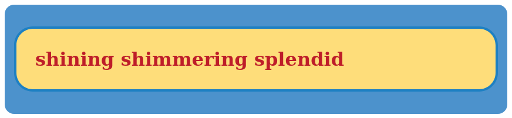
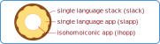

# how isomorphic is the isomorphic application?

In recent years, sometimes you'd see the term [isomorphic application](https://en.wikipedia.org/wiki/Isomorphic_JavaScript) or "universal application" used to refer to applications that share the same code on the front-end and back-end, the code being JavaScript or TypeScript, the front-end running on the browser and the back-end running on `Node.js`.

For developers that work across both ends of the stack, there is certainly an advantage in being able to share tests and validators. Not having to context-switch to a different language mindset probably also improves developer productivity.

That said, front-end code is typically more than just JavaScript: there's also HTML, a language of display structure, and CSS, a language of style. What's more, many codebases use templating languages to generate HTML, and preprocessing languages to generate CSS. It's languages upon languages; are you still "isomorphic"?

Why don't we go further and use the same language *everywhere*? But how? Well, we can start by generating our HTML using functions in JavaScript.

# I so morph the HTML

Instead of writing

```html
<div class="world">
  <h1>
    shining shimmering splendid
  </h1>
</div>
```

we can generate everything with code

```javascript
let div = document.createElement('div')
div.setAttribute('class', 'world')
let h1 = document.createElement('h1')
h1.innerText = 'shining shimmering splendid'
div.appendChild(h1)
```

Wait... do you see what I see? Yeah, code barf 🤮! We turned 29 code characters into more than 130 code characters and lost the visual representation of structure 🤦 [^how-count-code-characters].

[^how-count-code-characters]: I counted the characters by removing all non-display string literals ("world" and "shining shimmering splendid"), then removing all introns (aka [non-significant whitespace](https://en.wikipedia.org/wiki/Intron)), and counting the characters. So for the html example, we get `<div class=""><h1></h1></div>`, or 29 characters.

One solution to code barf is to add a translation layer so you can write something that looks nicer. JSX abstracts away the codification of HTML so it _looks like_ HTML while generating DOM objects. So you're actually creating DOM objects and the angle brackets are "syntactic sugar". But make no mistake: syntax sugar HTML is still bloody old HTML. JSX is really "JavaScript plus HTML". It's 2 languages rolled into 1 name. Sneaky!

Since HTML is structured using enclosed, named blocks, we can simplify them by writing the named blocks as arrays in JavaScript:

```javascript
["div.world",
  ["h1", "shining shimmering splendid"]]
```

Now we're down to 18 characters and it looks... acceptable[^hiccup-in-js]

[^hiccup-in-js]: this syntax is sometimes called "hiccup", and if you're interested in using it in your JavaScript stack, check out [this wonderful library](https://github.com/thi-ng/umbrella/tree/develop/packages/hiccup)

# so I also morph the CSS

Ok, what about CSS?

```css
div.world {
    padding: 1em;
    border-radius: 1em;
    background: #4C92CC;
}

h1 {
    padding: 1em;
    border-radius: 1em;
    background: #FEDD7A;
    border: 4px solid #1D80C3;
    color: #BE1D29;
}
```

For reference, this is what the css + html should generate:



In the HTML structure, since `div.world` contains `h1`, the `border-radius` and `padding` attributes are duplicated. We can use the [scss preprocessor](https://sass-lang.com/) to simplify it with code:

```css
div.world {
    padding: 1em;
    border-radius: 1em;
    background: #4C92CC;

    h1 {
        background: #FEDD7A;
        border: 4px solid #1D80C3;
        color: #BE1D29;
    }
}
```

Better: less repetitive, and reflects the HTML structure. It also looks pretty similar to JavaScript! Indeed, some nice folks already created a [library to generate CSS using JavaScript](https://github.com/cssinjs/jss). Based on JSS's introduction example then, we can write

```javascript
import jss from "jss";
import preset from "jss-preset-default";

jss.setup(preset());

const paddingAndBorderRadius = {
  padding: "1em",
  borderRadius: "1em",
}
const styles = {
  world: {
    ...paddingAndBorderRadius,
    background: "#4C92CC",
  },
  h1: {
    ...paddingAndBorderRadius,
    background: "#FEDD7A",
    border: "4px solid #1D80C3",
    color: "#BE1D29",
  }
};

const { classes } = jss.createStyleSheet(styles).attach();

document.body.innerHTML = `
<div class="${classes.world}">
<h1 class="${classes.h1}">
  shining shimmering splendid!
</h1>
</div>
`;
```

You can test this code on the [JSS sandbox](https://codesandbox.io/s/z21lpmvv33) from their tutorial.

But there's HTML! So then we do the array-to-html conversion like we did earlier and...

## stop! something smells strange

While we changed CSS into JavaScript objects, and changed HTML into arrays, they look pretty different from one another. Some objects take parentheses (as functions), some take dots (as purposeful properties), some are interpolated (as values in template strings).

Can we get something more stylistically unified, syntactically uncomplicated?

# another approach to styling syntax

let's try another array-like syntax for CSS

```javascript
["div.world",
 {
     padding: "1em",
     border-radius: "1em",
     background: "#4C92CC",
 },
 ["h1",
  {
      background: "#FEDD7A",
      border: "4px solid #1D80C3",
      color: "#BE1D29",
  }
 ],
]
```

This looks strikingly similar to the array syntax we used earlier for simplifying HTML! In fact, we can write _all_ the application code in a syntax like this, using [S-expressions](https://en.wikipedia.org/wiki/S-expression). To move in this direction, we can rewrite the front end parts like this:

## HTML components

```clojure
[:div.world,  ;; using a keyword notation, simplify "div.world"
 [:h1 "shining shimmering splendid"]]
```

## CSS styling

```clojure
[:div.world,  ;; using the keyword notation, unify div.world
 {
  :padding "1em"
  :border-radius "1em"
  :background "#4C92CC"
  },
 [:h1,
  {
   :padding "1em"
   :border-radius "1em"
   :background "#FEDD7A"
   :border "4px solid #1D80C3"
   :color "#BE1D29"
   }
  ]
 ]
```

## React-driven application logic

instead of this

```jsx
ReactDOM.render(
  <h1>I can throw you a world</h1>,
  document.getElementById('app')
)
```

we'd have something like [^rdom-is-not-reactdom]

[^rdom-is-not-reactdom]: while this example uses `rdom/render` as a counterpart of `ReactDOM.render`, it is actually [different code](https://github.com/reagent-project/reagent/blob/5bdbfcb0d9b2e7c7dcc5f7f4bab62dc3713d4988/src/reagent/dom.cljs#L29), but is equivalent in intent and function.

```clojure
(rdom/render
 [:h1 "I can throw you a world"],  ;; using the keyword notation for "h1" as above
 (js/document.getElementById "app"))
```

if somebody really wants angle brackets instead, we can also convert the application code above to something more angle-bracketty[^syntactic-isomorphism]

[^syntactic-isomorphism]: this transformation is an example of _actual_ isomorphism at the syntactic level: complete equivalence in meaning

```xml
<rdom:render>
  <h1>I can throw you a world</h1>
  <js:document.getElementById>
    app
  </js:document.getElementById>
</rdom:render>
```

(thankfully, it seems like nobody actually prefers this! Would you tie 4 spoons together just so that you have a fork? Didn't think so! Because obviously, you'd tie 4 knives together instead)

# the trick

So what we've really done here, was rewrite a bunch of front-end code into [ClojureScript](https://clojurescript.org/). [Clojure](https://clojure.org/) is one of a handful of [homoiconic languages](https://en.wikipedia.org/wiki/Homoiconicity), where code is expressed the same way as data in the language. To give a more concrete example, let's suppose we actually took the ~~xml~~ expression above that performs the `ReactDOM.render` function call, and store it _symbolically_ without evaluating it, using `quote` to indicate we want the expression as raw pieces of language:

```clojure
(def world  ;; assigns to a constant called `world`
  (quote
   (rdom/render
    [:h1 "I can throw you a world"]  ;; here we omit the commas, which are optional
    (js/document.getElementById "app"))))

world
;; > (rdom/render [:h1 "I can throw you a world"] (js/document.getElementById "app"))
```

`world` now contains the _symbols_ of the code, which we can then inspect...

```clojure
(nth world 1)
;; > [:h1 "I can throw you a world"]

;; we need "vec" here because we need the data as a "vector" to use get-in
(get-in (vec world) [1 1])
;; > "I can throw you a world"
```

and transform!

```clojure
;; we use "seq" at the end to turn the vector back into a list form
(-> (vec world)
    (assoc-in [1 1] "this is dog")  ;; go to index 1, then index 1, and change it
    (assoc-in [2] (quote js/document.body))  ;; go to index 2 and change it
    (seq))
;; > (rdom/render [:h1 "this is dog"] js/document.body)
```

We can then execute this statement in the browser if a evaluation (repl) connection is available, or send it through `eval` in the ClojureScript's runtime [^clojurescript-eval] to welcome `dog`. If you actually want to try this, see the [[# sample code]] section.

 [^clojurescript-eval]: to be clear, running `eval` on the ClojureScript runtime means we have to host the ClojureScript compiler in the browser, which is [possible](https://github.com/mhuebert/shadow-bootstrap-example) but beyond the scope of this discussion.

Since this method of transformation acts on _pieces of the code_, we can perform _any_ kind of transformation on these expressions as we please, regardless of whether the output is for HTML, CSS, JavaScript, or even JVM bytecode[^nvm-jvm]. At present, it seems to be the most complete solution for a single-language application stack[^other-single-language-solutions].

[^nvm-jvm]: since Clojure can target the Node virtual machine and the Java Virtual Machine, it's effectively an NVM+JVM language. Maybe it's the only one yet?

[^other-single-language-solutions]: a few other (open) languages in the space:
	- JavaScript obviously _can_ do everything, and at some point it probably _will_, but before ECMAScript 2049 comes out, the syntax will probably contain a lot of code vomit
	- [parenscript](https://parenscript.common-lisp.dev/) generates JavaScript for Common Lisp; this is the closest analogue for a full Common Lisp setup, but is not as well-maintained
	- [PureScript](https://www.purescript.org/) generates JavaScript for Haskell; though more generally I don't think Haskell syntax is well-suited for nested data-reshaping operations that makes LISPs particularly adaptable for HTML and CSS

# the catch

To be honest, I wouldn't recommend this approach to most people, even though I think it is awesome dancing donuts.

I mean, this is a _true_ implementation of the "isomorphic stack"! From WebGL in the browser to Kafka clients running in microservices, all in one language. And if you need scripts for the shell, Clojure's still [got you covered](https://github.com/babashka/babashka)! It's s-exprs all the way down!

The biggest problem, alas, is _mindshare_.

Mindshare means answers to questions when you hit edge cases, that there are always neat discussions on chat, better tools and syntax support across more environments, more companies hiring for new developers, more job applicants for hiring companies, easier training, more complete documentation...

Mindshare means a lot.

But, if you're doing functional programming for the fun of it, yeah, it's fun! Bouncy, trouncy, flouncy, pouncy `(fun (fun (fun (fun (fun`


Rumor says that the stripes on this tiger are actually parentheses from a functional language.

# conclusion

It's not just iso and morphic, it's iso-more-terrific and homoiconic! Let's call this the "isohomoiconic application". To illustrate, here's a donut:



We have the SLACKers (different kind of slack 💬), then we have the SLAPPers (another kind of slap 🎸), then the IHOPPers (different ihop 🥞). I confess, this doesn't illustrate anything interesting. I just wanted to draw a donut and use the pancakes emoji.

To close: code is data, front is back, LISP is `fn`, and that's a ~~hack~~ wrap.

# sample code

A fully-functional demo of the all-ClojureScript setup discussed above can be found [here](https://github.com/whacked/demodemodemodemo/tree/master/isohomoiconic-app). It uses [macchiato](https://macchiato-framework.github.io/) as the webserver, [thi.ng/hiccup](https://www.npmjs.com/package/thing-hiccup) for generating HTML, [garden](https://github.com/noprompt/garden) for CSS, and [reagent](https://reagent-project.github.io/) for data-flow and reactive updates. It also generates random CSS on-the-fly and restyles the header by reactively updating a `style` tag [^reagent-wizardry].

If you have the [nix package manager](https://nixos.org/download.html) installed, clone the repo and activate the environment with `nix-shell` and follow the hints. Otherwise, follow the steps codified in [shell.nix](https://github.com/whacked/demodemodemodemo/blob/ab3b1fe7ca5223c160e14ad47a48a97ce76d2cba/isohomoiconic-app/shell.nix#L12).

Once the browser is running, you can connect to the browser using the [browser-repl function](https://github.com/whacked/demodemodemodemo/blob/ab3b1fe7ca5223c160e14ad47a48a97ce76d2cba/isohomoiconic-app/shell.nix#L46), where you can evaluate the statements from the examples above, including the `world`  manipulation example, as-is.

[^reagent-wizardry]: [React hooks](https://reactjs.org/docs/hooks-intro.html) was announced in 2018, and now [hooks vs components](https://stackoverflow.com/q/53062732) is a thing and now you have [useState](https://reactjs.org/docs/hooks-state.html) to manage component state, [useEffect](https://reactjs.org/docs/hooks-effect.html) for side effects on component state, and [context](https://reactjs.org/docs/context.html) for "global state" and, and, and. In 2014, Reagent handled component state using the [ratom](https://github.com/reagent-project/reagent/tree/23ae1661feeb3dc4ab82d2622f4f890d21aa2f65#examples); in 2022, Reagent handles component state using... the [ratom](https://github.com/reagent-project/reagent/tree/7986c133f24ea5ae97fef5821bfce037821d0b95#examples)
