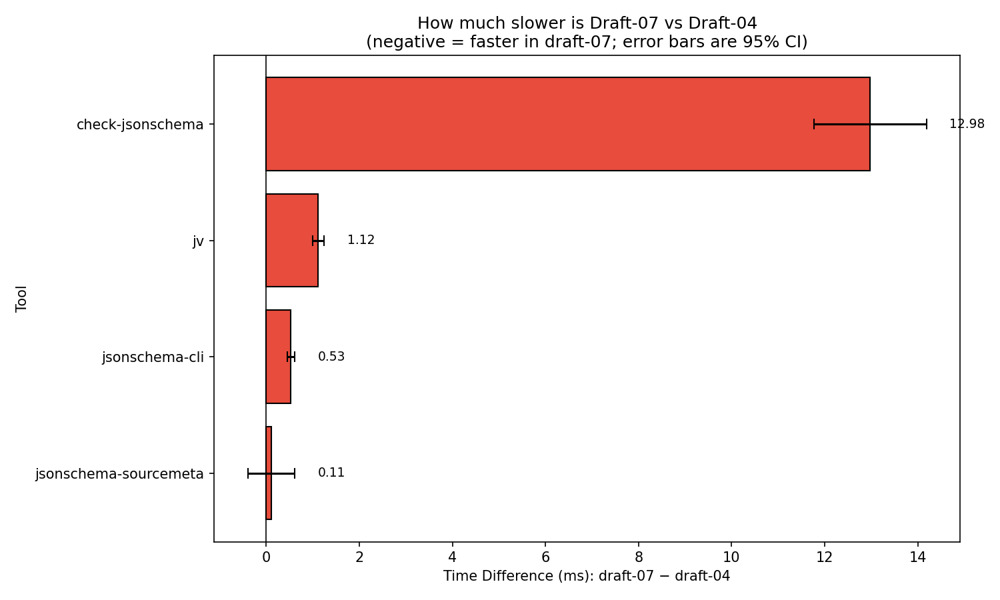

# vibenchmarking different json schema validator CLI tools

_authored by a human_

**tl;dr**: if you need a json schema validator command line tool, use [Stranger6667's high-performance json schema validator](https://github.com/Stranger6667/jsonschema). It's quite performant indeed!

---

# background

I like types... actually, types are ok.

What I really like is knowing the shape of the data. When I jump into a function, set a breakpoint, or capture a packet, I first want to understand the landscape of the data in our environment; once we know what actors are on stage, I want to know what shapes they have. And once we have the shape -- in code or in data -- I like to have it in writing.

There are a handful of tools that sit above any specific business logic and let us define language-agnostic structure definitions. A few well known ones:
- [protobufs](https://protobuf.dev/)
- [cue](https://cuelang.org/)
- [dhall](https://dhall-lang.org/)
- [JSON Schema](https://json-schema.org/)

As you might have guessed, JSON Schema is my preferred tool.

While several other languages have superior writing ergonomics and expressive power, it's hard to argue with JSON's ubiquity. And in most cases of dealing with simple tabular data, CSVs, unbig matrices, or RDBMS rows, we can express entities as JSON numeric or object arrays. So sometimes, I would start a project by defining JSON Schemas of the data I expect to work with, then use codegen tools to generate classes and interfaces for consumers of that data. This workflow isn't that interesting if you use protobufs, but for JSON schema, tooling is a bit more spread out. For Python, I use [datamodel-code-generator](https://datamodel-code-generator.koxudaxi.dev/) to get pydantic v2 classes; for Go I use [go-jsonschema](https://github.com/omissis/go-jsonschema) to get structs; for TypeScript there's [json2ts](https://github.com/GregorBiswanger/json2ts) to get plain interfaces or [quicktype](https://github.com/glideapps/quicktype) for classes.

And since JSONL datasets are everywhere now, in addition to enforcing structure at the start of the implementation pipeline, we also want to validate data at the end -- after receiving data records. And if we're working in the shell, we'll be piping records to validators like we pipe JSON into `jq` or pipe text into `{rip,}grep`.

# what to vibenchmark

Now the question is: what's the ripgrep for json validation?

Well that's easy, isn't it? A validator only needs to take a schema, a json payload, and tell us what violations it found. `ripgrep` is fast, so we'll try to find one that's fast too.

So all we need to do, is take a program, prepare a baseline schema, and
- test meta-schema validation against this schema
- create some dummy instance and validation that dummy instance against the schema
- run the validation many times and average the run times

Then I discussed this with a agent, and the problem took on many more dimensions! We ended up designing for how validation speed varies as a function of
- draft version
- sdtin vs file input (who knows)
- valid vs invalid data (maybe it exits early on invalid data, leading to faster exit)
- instance size
- schema size
- schema complexity
- etc

This started out somewhat frivolous, but the agent lowered the barrier for more interesting explorations. So why not.

# command line json-schema validation tools

For years, I used [check-jsonschema](https://github.com/python-jsonschema/check-jsonschema) for json schema validation in the shell, because it's based on the venerable [implementation by Julian Berman](https://github.com/python-jsonschema/jsonschema), and because I can easily launch a quick dev sandbox using `nix-shell -p check-jsonschema` or add that to `buildInputs`. But it's been _years_, and it would be nice to not pull in Python just for validation.

So we look around for tools that are packaged as a single command line executable and provide at least these features:
- validate given json data against given json schema
- validate a json schema against some known [json meta-schemas](https://json-schema.org/specification-links)

## the contenders

- `check-jsonschema`: [check-jsonschema, version 0.36.0](https://github.com/python-jsonschema/check-jsonschema)
- `jv`: [santhosh-tekuri's jsonschema v6.0.1](https://github.com/santhosh-tekuri/jsonschema)
- `jsonschema-sourcemeta`: [sourcemeta's jsonschema v12.9.3](https://github.com/sourcemeta/jsonschema/)
- `jsonschema-cli`: [Stranger6667's jsonschema v0.38.1](https://github.com/Stranger6667/jsonschema)

Note that some of these tools are not the latest version, because I used tools with the shortest path to inclusion into `shell.nix`.

# making the agent do the work

Since I like defining structure from the start, I think I've violated the first principle of vibe coding, that of having vibe. I got no vibe, I describe. Then I press yes yes yes because yolo. But sometimes, I also press no.

Anyway, I've read about [AGENTS.md](https://agents.md/) but don't have a habit of maintaining one. It sounds like a chore, but also makes sense: I want agent-generated commits to start with "[ai]", and in agent sessions, re-typing "prefix your main commit message with [ai]" gets old, so putting it in `AGENTS.md` saves that repetition. My dev environment is always defined in `shell.nix`, so look there for dependencies. Oh, and the python venv is managed by `uv`. Oh, and blah blah blah.

Since I probably can't recall upfront all the things I want the agent to keep in mind before I start, ChatGPT helped me start the `AGENTS.md`. In doing so, I also discussed the overall concept of the project.

<details>

```
our dev env is ALWAYS defined using shell.nix.

the agent should know that we develop inside a nix-shell env; if we add/remove dependencies it will be through updating shell.nix. current project is called json-schema-cli-benchmark.

we are going to create a benchmark repo to compare performance of different json schema clis.

while we're at it, you can help me with scoping out the architecture of this repo.

background:
- our projects often use json schemas, so there is a lot of validation requirements during the dev cycle, both in validating the schemas (against metaschemas) or validating i/o data against our json schemas.
- we are relatively conservative with the schema versions and don't use too many advanced features like in-schema pointers, because when we use json schemas as data shape ground truth, we do a lot of manual editing against them, so generally we like to keep the schemas human editable.
- we have a command line centric workflow, bash or zsh, so a lot of the I/O validation would be to/from json files.
- we also do a lot of stream piping, so for best ergonomics, we would want to have a validation flow that handles stdin/stdout. not a hard requirement if the validator is good enough.
```

</details>

ChatGPT came back with some decent questions, largely related to the high level design. I didn't realize that's something to put into `AGENTS.md`?

<details>

> ## 1) What exactly do we benchmark? (the “benchmark matrix”)
>
> **Q1.1: Should the benchmark matrix include both schema validation (schema vs metaschema) and instance validation (data vs schema), or only instance validation?**
>
> > **Answer:** our goal is to take a bunch of different CLI tools that provide json schema validation facilities to answer:
>   - how to validate a json schema against a metaschema (we will need to find the json schema versions they all understand in common, and target the latest of those. we should leave the possibility to ALSO benchmark different versions, but for simplicity, just target the common latest now. but that also means that the benchmark output table ALSO has the field for the version, except for our current benchmarks, we either hide that field, or every row will have the same value in the output)
>   - oh yes, so our benchmark will show a breakdown of validation of the local schema against metaschema (plus how to do that -- the command) AND that of the local schema against the instance data
>
> **Q1.2: Which schema drafts do we care about initially (2020-12, 2019-09, draft-07, draft-04)?**
>
> > **Answer:** Whichever is the common, latest; though, we don't expect to validate the tool's coverage. We will provide example data.
>
> **Q1.3: What input patterns matter most (file → stdout, stdin → stdout, or multi-file batch)? Pick your top 2.**
>
> > **Answer:** `stdin` -> `stdout` is first, `file` -> `stdout` is second.
>
> **Q1.4: What “dataset sizes” should we cover (tiny, medium, or large)? Pick which tiers you actually care about.**
>
> > **Answer:** <1MB is enough.
>
> ---
>
> ## 2) Benchmark semantics: how strict is “correctness parity” across tools?
>
> **Q2.1: Do we require all tools to validate the same schema+instance pairs with identical pass/fail results?**
>
> > **Answer:** Pass/fail results should be identical. I guess failures should just be marked as failures and we won't collect speed data when they can't perform.
>
> **Q2.2: Do you want to benchmark error reporting quality (message clarity, path reporting), or strictly speed + exit codes?**
>
> > **Answer:** Correctness then speed, so yes, error reporting quality is important, but less important than the ability to validate.
>
> ---
>
> ## 3) How do we run the benchmarks? (mechanics)
>
> **Q3.1: Preferred harness language (pure shell + hyperfine, or a Python runner)?**
>
> > **Answer:** Pure shell + hyperfine is fine.
>
> **Q3.2: Output format you want to publish (raw hyperfine JSON, normalized JSONL, or a generated REPORT.md)?**
>
> > **Answer:** I didn't think deeply about this yet. Will it accommodate later complexity such as different experimental setups, like different schema sources (some repos come with benchmarks using like swagger schemas, geojson, zuora api handling etc.), or do we need more hierarchical management?
>
> ---
>
> ## 4) Repo architecture
>
> **Q4.1: Which layout do you want: A (minimal) or B (structured)?**
>
> > **Answer:** A looks cleaner but like 3.2, what will we do about more complex tests?
>
> **Q4.2: Do you want results committed to git?**
>
> > **Answer:** Yes; EVERYTHING to git. So JSON files should be prettified, and JSONL lines cannot be too variable in length.
>
> ---
>
> Would you like me to draft a proposed directory structure for **Layout A** that incorporates the hierarchical management you mentioned for complex tests?

We soon ditched the "common latest" approach in picking the schema to test, in favor of per-draft-version outputs.

</details>

After a few back-and-forths, ChatGPT declared it's done with `AGENTS.md`

<details>

> What’s next (whenever you’re ready)
>
> When you say the word, next steps can be:
>
> define the benchmark case model (schema + instance + expected result)
>
> design a tool adapter interface (how each CLI plugs in)
>
> choose an initial repo layout that stays simple now but scales to more datasets later
>
> For now, your AGENTS.md is complete and enforceable.

</details>

Although ChatGPT loves to ask me to "say the word", I never say the word.

Instead, I told GPT to start a `PLAN.md` file, which it eagerly generated without any input, so I tightened control.

<details>

> before this, i need to add to the structure expectation. we have a generators/ directory, that will contain jsonnet files, and a Makefile at the root, which will use the generators to generate files in the ./schemas/ directory, which will contain project-level (meta) schemas, that will define and corral the shape of the data we care about (i.e. if we are aggregating from hyperfine output, we need to store the schema of the output from hyperfine; we will also have an optional meta-validation command that we can invoke from the makefile, that validates the stored output data to ensure they abide by the schema. any transformers that operate on the data we include in this repo should be subject to this process). does this make sense? if it does, add it to PLAN.md otherwise ask for clarification until you are crystal clear

</details>

Soon after, ChatGPT spelt out a directory layout for every experiment in the plan text + steps to set up a new experiment.
My concern is that even if the experiment is run by an agent, the directory structures are unenforced.
So I took a detour to make [dirschema](https://github.com/whacked/dirschema) first, a utility that uses json-schema to validate and hydrate a directory.
From here on, the code generation is all Claude Code.

# getting test cases

This took _much_ longer to design than I anticipated due to all the interesting variables to consider. For example, we can compare different behaviors in resolving `$ref` in the schema, or `oneOf`, or handling optional fields. But since we are comparing runtime in "general" usage, these other questions are mostly academic curiosities. We will just design to accommodate that level of flexibility but limit our total testing. That said, even in limited testing, we want to cover enough cases to illustrate the design's effectiveness.

After we decide the scope of json schemas to test, we make the agent create a [jsf](https://github.com/ghandic/jsf)-driven python script that takes the json schemas and generates random instances that fulfill that schema. To generate invalid cases and schemas, we mutate a valid instance / schema.

Per the manifest structure suggested by ChatGPT (and validated by `generators/manifest.schema.jsonnet`), we must pre-specify all the kinds of experiments we want to run. The case names are mostly self-explanatory, aside of the payload sizes (S, M, L, XL)

```sh
cat experiments/draft-04/manifest.json | jq '.cases | keys | .[]' -r | grep _M_ | grep invalid
```
```
array_objects_M_invalid
array_primitives_M_invalid
array_tuple_M_invalid
combinators_allOf_M_invalid
combinators_oneOf_M_invalid
dependencies_M_invalid
enum_uniqueItems_M_invalid
object_basic_M_invalid
object_deep_M_invalid
object_wide_M_invalid
patternProperties_M_invalid
ref_graph_M_invalid
```

the jsf-based generator creates random test files for each case by reading the case's json schema:

```sh
find experiments/draft-04/cases/patternProperties_M_valid -type f | head -3
```
```
experiments/draft-04/cases/patternProperties_M_valid/schema.json
experiments/draft-04/cases/patternProperties_M_valid/instances/gen_0018.json
experiments/draft-04/cases/patternProperties_M_valid/instances/gen_0014.json
```

```sh
cat experiments/draft-04/cases/enum_uniqueItems_M_invalid/instances/wrong_enum_value_0000.json | jq | head -5
```
```
{
  "tag": "not_in_enum",
  "xs": [
    8201,
    2059,
```

Claude also generated the benchmark runner and experiment status inspection tooling (which eventually became a giant [justfile](https://github.com/casey/just)). Then we `just run` and wait for the data.

# generating the data explorer

At this point the project has already ballooned into more than I wished for and I don't want to think about frontend. Agent-based visualization building makes frontend code seem disposable... so I just described the data to Claude and asked it to create the viz, specifying that we should use [duckdb-wasm](https://duckdb.org/docs/stable/clients/wasm/overview) for loading the data, and show plots that stratify the data sensibly.

The first version was quick work, but came with a "[signature](https://old.reddit.com/r/ClaudeCode/comments/1pxqjvq/how_to_make_claude_stop_designing_gradient/) [purple](https://prg.sh/ramblings/Why-Your-AI-Keeps-Building-the-Same-Purple-Gradient-Website)" look that seems to be common with claude.


Just for kicks, a second try from a clean slate had the same feel:


Here's the version I accepted after requesting changing the viz to [ECharts](https://echarts.apache.org/en/index.html) and the frontend framework to [bootstrap](https://getbootstrap.com/), so I can pick the ([sketchy](https://bootswatch.com/sketchy/)) theme


The viz is a single html file which I serve using `python3 -m http.server`. Claude devised an "auto-discover" mechanism to automatically load the data files in the `results/` directory by parsing the directory listing that python's server responds with for a directory without an index file.

# results

## schema vs instance run times

with the caveat that the schema sizes in the experiment dataset are generally < 2MB, in our runs the schema processing speed is not markedly different from instance processing speed for similar-sized payloads, so we'll focus on instance processing.

## check-jsonschema is _slow_

A big part of this has got to be from Python startup. But since we care about CLI usage here, it counts every time!


## sourcemeta's jsonschema is bad at processing increasing enums


The interesting jump in runtimes around the 10KB payload size happens for all the enum tests for `sourcemeta-jsonschema`

## instance processing time increases with array length

(`check-jsonschema` excluded henceforth)


the exponential-looking increase matches the exponential increase in case-size in the generation script so it's a linear increase in runtime; no surprise here.

```sh
for f in experiments/draft-04/cases/array_objects_*_valid/instances/gen_0000.json; do echo $f; cat $f |
  jq '.[]|length' |
  uniq -c;
done
```
```
experiments/draft-04/cases/array_objects_S_valid/instances/gen_0000.json
     32 4
experiments/draft-04/cases/array_objects_M_valid/instances/gen_0000.json
   1024 8
experiments/draft-04/cases/array_objects_L_valid/instances/gen_0000.json
   4096 16
experiments/draft-04/cases/array_objects_XL_valid/instances/gen_0000.json
   8192 32
```

## short-circuiting behavior

For this, we compare the times between valid cases (which require checking until the end) vs. cases where there are mutations.

```sh
head -7 experiments/draft-04/cases/array_objects_S_invalid/instances/wrong_type_*_000[0314].json
```
```
==> experiments/draft-04/cases/array_objects_S_invalid/instances/wrong_type_early_0000.json <==
[
  [
    "was",
    "object"
  ],
  {
    "f0": 260,

==> experiments/draft-04/cases/array_objects_S_invalid/instances/wrong_type_early_0003.json <==
[
  [
    "was",
    "object"
  ],
  {
    "f0": 238,

==> experiments/draft-04/cases/array_objects_S_invalid/instances/wrong_type_late_0001.json <==
[
  {
    "f0": "3244",
    "f1": 302,
    "f2": 2359,
    "f3": 5743
  },

==> experiments/draft-04/cases/array_objects_S_invalid/instances/wrong_type_late_0004.json <==
[
  {
    "f0": "6519",
    "f1": 3884,
    "f2": 3766,
    "f3": 7485
  },
```

Inspecting the `wrong_type_early` vs `wrong_type_late` cases here shows that the generated invalid cases are actually **incorrect** for `wrong_type_late`: the wrong types are _also_ early. I don't want to tell Claude to fix this, so we just treat all `array_object_*_invalid` cases the same. If there is short-circuiting, we should see a substantially shorter validation time.

| Case    | Tool                  | Avg (ms) | Std    | Min    | Max     |
|---------|-----------------------|----------|--------|--------|---------|
| valid   | check-jsonschema      | 3141.35  | 597.9  | 507.84 | 4067.65 |
| invalid | check-jsonschema      | 3037.94  | 933.95 | 529.42 | 4112.94 |
| valid   | jsonschema-cli        | 180.6    | 40.76  | 7.87   | 267.64  |
| invalid | jsonschema-cli        | 175.36   | 64.96  | 5.73   | 262.9   |
| valid   | jsonschema-sourcemeta | 561.25   | 138.36 | 48.41  | 789.09  |
| invalid | jsonschema-sourcemeta | 484.61   | 160.16 | 53.57  | 666.13  |
| valid   | jv                    | 681.2    | 168.91 | 31.96  | 924.05  |
| invalid | jv                    | 670.93   | 242    | 19.75  | 898.57  |

Across all tools, the average invalid time is less than the average valid time, but the difference is not statistically significant. This is not surprising if we expect the validators to validate every item in the array, even if the first element is invalid.

## the non-Python validators

then, excluding the `enum_uniqueItems` cases that trip up `sourcemeta-jsonschema`'s validator,


| Tool                  | N    | Avg (ms) | Std    | Min  | Max    |
|-----------------------|------|----------|--------|------|--------|
| jsonschema-cli        | 1320 | 23.98    | 30.85  | 5.73 | 267.64 |
| jv                    | 1333 | 45.8     | 103.36 | 8.96 | 924.05 |
| jsonschema-sourcemeta | 1332 | 56.87    | 91.61  | 8.08 | 789.09 |


**Looks like Stranger6667's validator runs faster overall.**


| Tool           | N    | Avg (ms) | Std   | Min  | Max    |
|----------------|------|----------|-------|------|--------|
| jsonschema-cli | 1230 | 17.39    | 10.44 | 6.17 | 107.18 |
| jv             | 1243 | 27.1     | 5.52  | 8.96 | 73.33  |

so that answers our initial question.

Then, if we remove the tests that run longer than 100ms (`array_objects_L_{valid,invalid}`, `object_deep_XL_{valid,invalid}`)


they interestingly slow down on different things!


## what about different draft versions?

I copied the experiment setup from `draft-04`, updated the target draft string, and reran both on my laptop.

Uh... adding the breakdown to the interactively viz in the frontend was a bit tedious [1] so I succumbed to asking Claude to write python. Generally speaking, yes, draft-07 is slower.



[1] we want to take the difference in hyperfine run time between the same tests run on `draft-07` vs on `draft-04`, and see whether it is significantly different from 0. After describing the approach in sufficient detail, I didn't think it was worth adding a highly specialized plot into the interactive page, so asked claude to make a one-off python script.

# epilogue

after reviewing the project repo I was extremely annoyed by the output file hierarchy. There were 6000+ directories in every full run, one directory per test case. This was likely the result of instructing the agent to output raw, prettified json by default, and since we were only capturing hyperfine json output, it simply saved every job's output to its own directory. Under small, frequently manually inspected cases, this is reasonable, but this made a large part of the data storage cost driven by inode count rather than bytes of data.

## further exploration

there are certainly more angles to explore the data. the data and code for the results covered here are at https://github.com/whacked/json-schema-cli-benchmarks; the data are pushed using git-lfs
